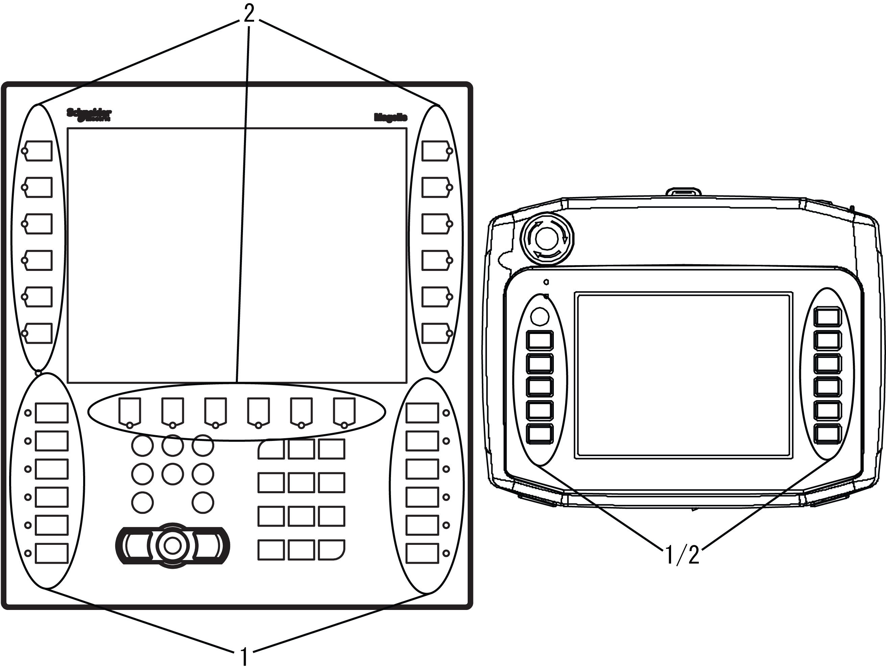

# XBT GK/GH Function Keys

XBT GK/GH Function Keys

1   Static Function Keys

2   Dynamic Function Keys

NOTE: Static keys (Fi) can be customized by printing text or pictograms on the insert labels using label design templates in Vijeo Designer. Dynamic keys (Ri) can be linked to labels or images on the screen using tools in Vijeo Designer.