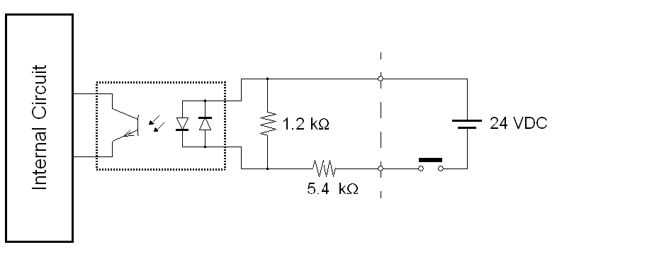
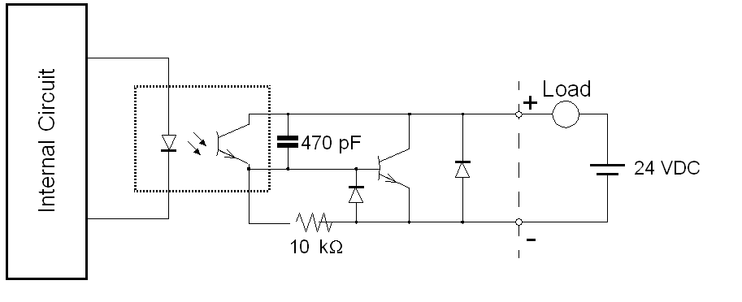

# Sound Output/AUX Input/Output Interface for XBT GT 4000/5000/6000/7000 Series and XBT GK 5330

Sound Output/AUX Input/Output Interface for XBT GT 4000/5000/6000/7000 Series and XBT GK 5330

The following table describes the output interface specifications for the AUX Port:

|  |  |
| --- | --- |
| Sound Output Interface | Speaker output:  70 mW (rated load: 8W, frequency:1 KHz)  Connector: two piece type terminal block |
|  | XBT GT2430 speaker output:  70mW (rated load: 8 Ω)  Connector: MINI-JACK 3.5 mm (0.13 in.)  Audio characteristics:  Harmonic distortion: 5 % max.  Bandwidth: 100 Hz ~ 2 KHz |
| AUX Input/Output Interface | Alarm output, RUN output; buzzer output:  Rated voltage: 24 Vdc  Rated current: 50 mA |
| Remote reset input:  Input voltage: 2 Vdc  Input current: 6 mA  Operating voltage: (when ON) minimum 9 Vdc, (when OFF) maximum 2.5 Vdc  Connector: two piece type terminal block |

This interface is used for external reset and outputs (alarm, buzzer, sound, run):

| Pin Connection | Pin | Signal Name | Direction | Meaning |
| --- | --- | --- | --- | --- |
| G-SA-0033776.1.gif-high.gif | 1 | RESET IN\_A | Input | External reset input |
| 2 | RESET IN\_B | Input |
| 3 | RUN+ | Output | RUN signal |
| 4 | RUN– | Output |
| 5 | ALARM+ | Output | ALARM signal |
| 6 | ALARM– | Output |
| 7 | BUZZER+ | Output | Buzzer signal |
| 8 | BUZZER– | Output |
| 9 | NC | – | Not connected |
| 10 | NC | – | Not connected |
| 11 | SP | Output | Speaker out |
| 12 | SP\_GROUND | Output | Speaker ground |

Input Circuit

Output Circuit

