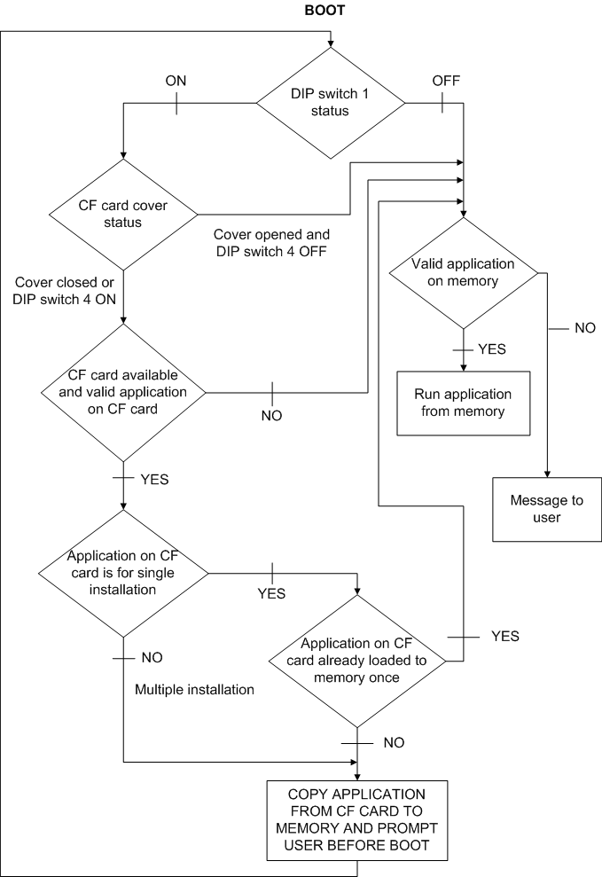
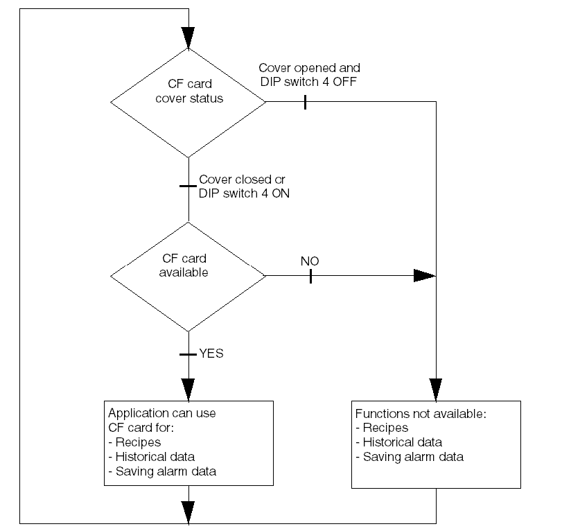

# Parameter of CF Card DIP Switches

Parameter of CF Card DIP Switches

The following table explains CF card DIP switches parameters for the targets.

| XBT GT2000 and higher and XBT GK | | | |
| --- | --- | --- | --- |
| Dip Switch | Function | ON | OFF |
| 1 | Controls downloading from CF card. | The application downloads from the CF Card and transfers into the internal memory. | - |
| 2 | Reserved | - | - |
| 3 | Reserved | - | - |
| 4 | Controls the forced closing of the CF card cover (used when CF card cover is damaged). | Forced close enabled. | Forced close disabled. |

| XBT GH | | | |
| --- | --- | --- | --- |
| Dip Switch | Function | ON | OFF |
| 1 | Controls downloading from CF card. | The application downloads from the CF Card and transfers into the internal memory. | - |
| 2 | Forced Transfer mode | Forced Transfer mode: ON | Forced Transfer mode: OFF |
| 3 | Reserved | - | - |
| 4 | Controls the forced closing of the CF card cover (used when CF card cover is damaged). | Forced close enabled. | Forced close disabled. |

The following diagram describes in detail the way the unit behaves in BOOT mode, based on the DIP switch settings and the CF card status:

The following diagram describes in detail the way the unit behaves in RUN mode, based on the DIP switch settings and the CF card status:

