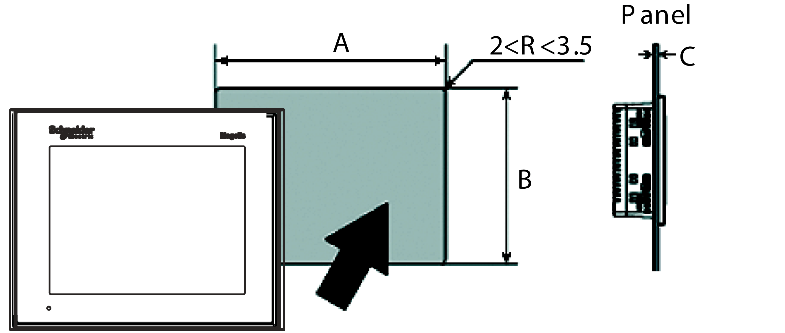

# Inserting a XBT GT/XBT GK

Inserting a XBT GT/XBT GK

Create a panel cut-out and insert the unit into the panel from the front. The following illustration shows the panel cut-out for a XBT GT/XBT GK unit (example from the XBT GT1005series).

