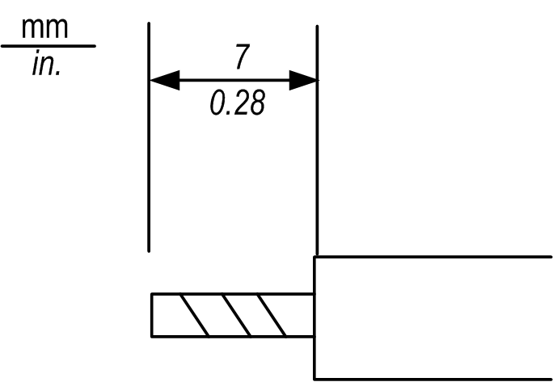

# Power Cord Preparation

Power Cord Preparation

NOTE:

oMake sure the ground wire is the same gauge or heavier than the power wires.

oDo not use aluminum wires in the power cord for power supply.

oIf the conductor’s end (individual) wires are not twisted correctly, the end wires may either short loop to each other or against an electrode. To avoid this, use D25CE/AZ5CE cable ends.

oWherever possible, use wires that are 0.2...2.5 mm2 (24 - 12 AWG) for the power cord, and twist the wire ends before attaching the terminals.

oThe conductor type is solid or stranded wire.

