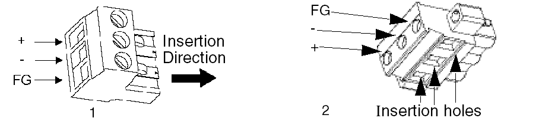

# Power Plug Illustration

Power Plug Illustration

1   Power plug for XBT GT1005/2000/4000 series and XBT GK2000 series

2   Power plug for XBT GT5000/6000/7000 series and XBT GK5000 series

| Connection | Wire |
| --- | --- |
| + | 24 Vdc |
| - | 0 Vdc |
| FG | Grounded terminal connected to the unit chassis. |