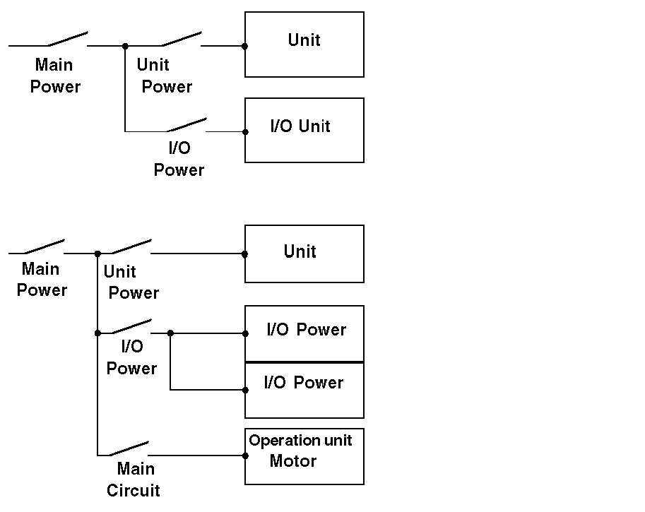
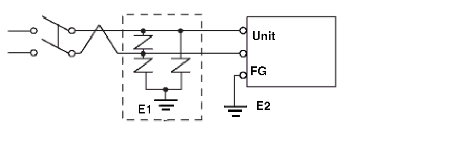

# Power Supply Connections

Power Supply Connections

For ease of maintenance, use the following optional connection diagram to set up your power supply connections.

NOTE:

oGround the surge absorber (E1) separately from the unit (E2).

oSelect a surge absorber that has a maximum circuit voltage greater than that of the peak voltage of the power supply.

The following displays a lightning surge absorber connection:

