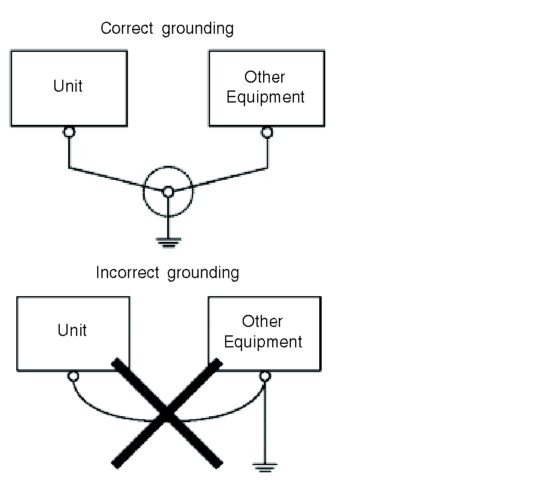

# Common Grounding

Common Grounding

Precautions:

Electromagnetic Interference (EMI) can be created if the devices are improperly grounded. Electromagnetic Interference (EMI) can cause loss of communication.

Do not use common grounding, except for the authorised configuration described below.

If exclusive grounding is not possible, use a common connection point.

