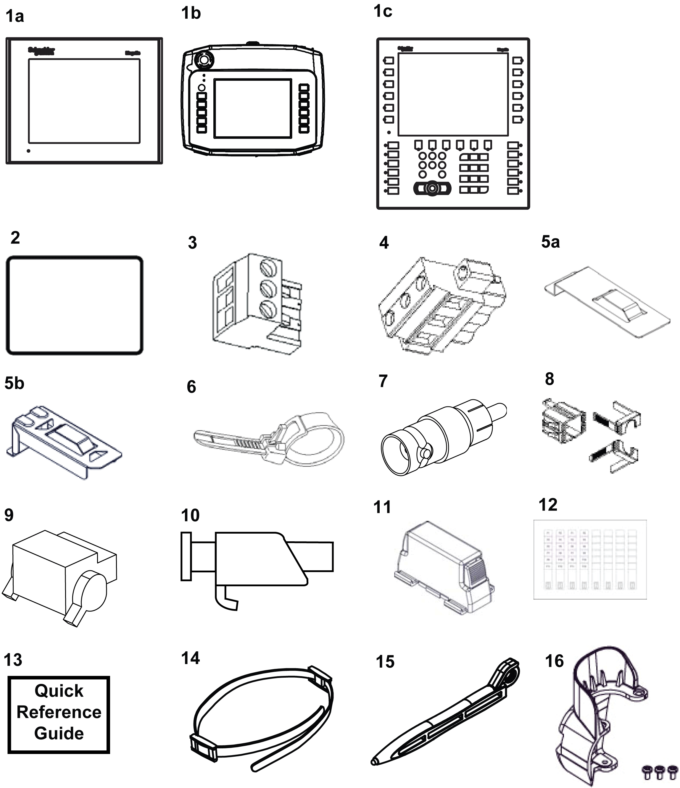

# Package Contents

Package Contents

Make sure all applicable items listed here are present in your unit’s package:

1a or 1b or 1c   Human Machine Interface

2   Installation Gasket (not available for the XBT GH series)

3   Power Plug (for XBT GT1005/2000/4000 series, XBT GK2000 series)

4   Power Plug (for XBT GT5000/6000/7000 series, XBT GK5000 series)

5a   USB Holder (for XBT GT2000 series)

5b   USB Holder (for XBT GK series)

6   USB Cable Clamp (for XBT GT2000 series, XBT GK series)

7   RCA-BNC Convertor (for XBT GT4340/5340/6340/7340)

8   USB Holder, 1 set (for XBT GT1005/4000/5000/6000/7000 series)

9   AUX Connector (for XBT GT4000/5000/6000/7000 series, XBT GK5000 series)

10   Screw installation fasteners (XBT GT1005/2000/4000/5000/6000 series: x4, XBT GT7000 series: x8, XBT GK series: none)

11   Spring Clip (for XBT GK2000 series: x10, XBT GK5000 series: x12)

12   "Insert Labels" set (for XBT GK series and XBT GH series: contains 2 sets of premarked labels and 4 blank labels)

13   Quick Reference Installation guide

14   Hand Strap for XBT GH

15   Touch Pen stylus for XBT GH

16   Emergency Switch Guard for XBT GH

Revision

You can identify the product version (PV), revision level (RL), and the software version (SV) from the product label sticker pasted on the unit.

The following diagram show a typical representation of label sticker:

35010372.19

© 2016 Schneider Electric. All rights reserved.