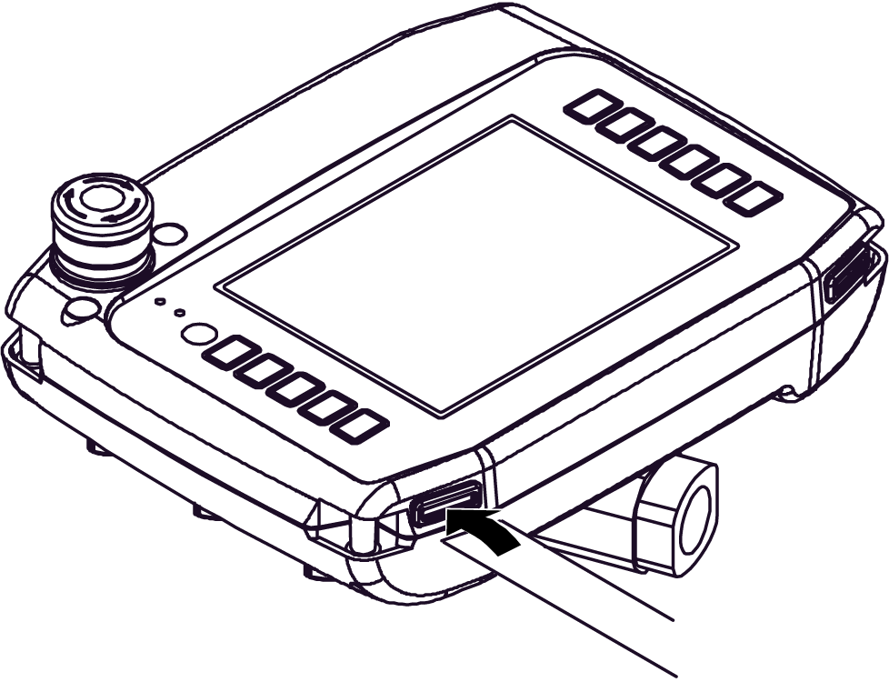

# Insert Labels XBT GK and XBT GH

Insert Labels XBT GK and XBT GH

Overview

XBT GKs and XBT GHs are delivered with an insert label sheet providing the following label types to assign different texts or symbols to the function keys:

ofunction key labels

oblank labels

All labels are pre-cut and just have to be pressed out of the label sheet.

The ready-to-use function key labels can directly be inserted into the XBT GK and XBT GH as described [below](#XREF_D_NA_0013477_9).

Printing Insert Labels

You can print our your own text or symbols on the blank labels. Make sure to remove the protective layer from the label sheet before printing. To print your own labels, use Vijeo Designer and one of the following laser printers:

oLaser printer Epsom 6200L

oCopier Lexmark X852e

|  |
| --- |
| Warning_Color.gifWARNING |
| UNINTENDED EQUIPMENT OPERATION |
| Make sure that the text/symbols on your insert label always correspond to what is configured for the XBT GK or XBT GH in Vijeo Designer. Otherwise the keys of your unit will not initiate the actions indicated on them. |
| Failure to follow these instructions can result in death, serious injury, or equipment damage. |

Inserting Insert Labels

|  |
| --- |
| Caution_Color.gifCAUTION |
| WATER DAMAGE |
| Be sure to insert the labels properly and slide the flap correctly into the chassis slit. Do not pinch the flap between the product and the panel. |
| Failure to follow these instructions can result in injury or equipment damage. |

Insert the labels into the device carefully. Make sure that they indicate the correct functions on the panel. The labels can be replaced as needed.

Graphical Representation of Correctly Inserting Labels into the XBT GK

The following describes the procedures of inserting insert labels into the XBT GK.

Inserting Labels into the XBT GK

| Step | Action |
| --- | --- |
| 1 | Press the pre-cut insert label of your choice out of the insert label sheet. |
| 2 | Remove the XBT GK from any enclosures or mounts. Take the XBT GK and turn it around so that you can see its rear panel. At the bottom two corners of the rear panel, located directly behind the overlapping display, you will find the opening for the insert label. |
| 3 | Insert the insert label cautiously into this opening (as shown in the above figure) until the key symbols / text on the wide part of the insert labels have disappeared and the wide part of the insert label is flush with the opening. There will be merely the small flap of the insert label with the double arrow being visible outside the unit. |
| 4 | Turn the XBT GK around and check the front that all symbols / text are clearly visible at the keys. If the text / symbols are not clearly visible, insert the insert label a bit further into the opening. |
| 5 | If the text / symbols are clearly visible on the front of the unit, take the small part (with the double arrow sign) of the insert label that is still visible on the rear of the unit and slide this flap into the slit. The flap should now be flush with the rear of the unit.  If the insert label has not correctly been inserted into the XBT GK, the flap of the insert label will be too long to fit into this slit. |

Graphical Representation of Correctly Inserting Labels into the XBT GH

The following describes the procedures of inserting insert labels into the XBT GH.

Inserting Labels into the XBT GH

| Step | Action |
| --- | --- |
| 1 | Press the pre-cut insert label of your choice out of the insert label sheet. |
| 2 | Take the XBT GH and turn it up so that you can see its bottom panel. On the lower right and left corners, you will find the opening for the insert label. |
| 3 | Remove the cover on the insertion hole and insert the insert label cautiously all the way into this opening (as shown in the above figure). |
| 4 | Check the front panel of the XBT GH that all symbols / text are clearly visible at the keys. If the text / symbols are not clearly visible, insert the insert label a bit further into the opening. |
| 5 | If the text / symbols are clearly visible on the front of the unit, put the cover back on the insertion hold.  If the insert label has not correctly been inserted into the XBT GH, the cover cannot be pressed into place. |

35010372.19

© 2016 Schneider Electric. All rights reserved.