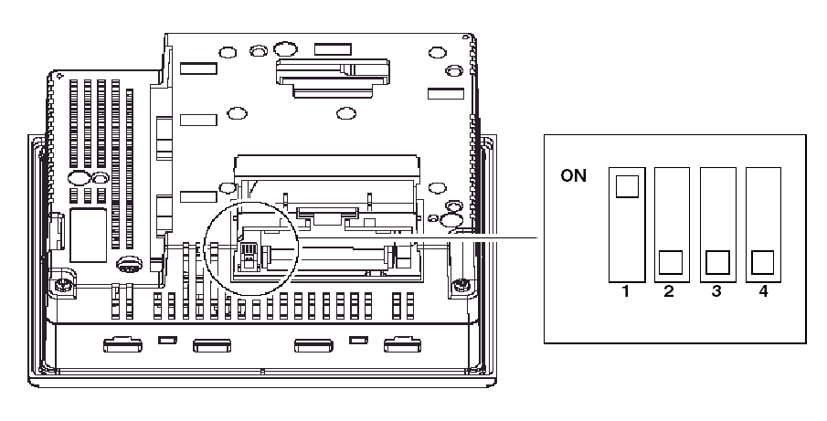

# Terminal Configuration Switches

Terminal Configuration Switches

Introduction

The RS-485 line polarization selector switch is available on all XBT GT and XBT GK series.

The CF card DIP switches are available on:

oXBT GT2000 series

oXBT GT4000 series

oXBT GT5000 series

oXBT GT6000 series

oXBT GT7000 series

oXBT GK series

oXBT GH series

Parameters of RS-485 Line Polarization Selector Switch

The following table explains the RS-485 line polarization selector switch parameters:

| Function | ON | OFF | Comment |
| --- | --- | --- | --- |
| Controls the polarization of the RS-485 serial line. | RS-485 serial line is polarized (620 Ω pull-up on D1 and 620 Ω pull-down on D0). | No internal polarization. | Polarization requires activation (ON) when the following two conditions are met:  oModbus or Unitelway protocol is implemented  oNo other equipment is polarizing the bus |

Location of CF Card DIP Switches

On XBT GH, XBT GK, and XBT GT2000 and higher units (except XBT GT2110), the CF card DIP switches are located under the CF card cover.

Parameter of CF Card DIP Switches

The following table explains CF card DIP switches parameters for the targets.

| XBT GT2000 and higher and XBT GK | | | |
| --- | --- | --- | --- |
| Dip Switch | Function | ON | OFF |
| 1 | Controls downloading from CF card. | The application downloads from the CF Card and transfers into the internal memory. | - |
| 2 | Reserved | - | - |
| 3 | Reserved | - | - |
| 4 | Controls the forced closing of the CF card cover (used when CF card cover is damaged). | Forced close enabled. | Forced close disabled. |

| XBT GH | | | |
| --- | --- | --- | --- |
| Dip Switch | Function | ON | OFF |
| 1 | Controls downloading from CF card. | The application downloads from the CF Card and transfers into the internal memory. | - |
| 2 | Forced Transfer mode | Forced Transfer mode: ON | Forced Transfer mode: OFF |
| 3 | Reserved | - | - |
| 4 | Controls the forced closing of the CF card cover (used when CF card cover is damaged). | Forced close enabled. | Forced close disabled. |

The following diagram describes in detail the way the unit behaves in BOOT mode, based on the DIP switch settings and the CF card status:

The following diagram describes in detail the way the unit behaves in RUN mode, based on the DIP switch settings and the CF card status:

35010372.19

© 2016 Schneider Electric. All rights reserved.