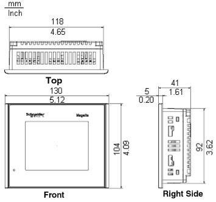
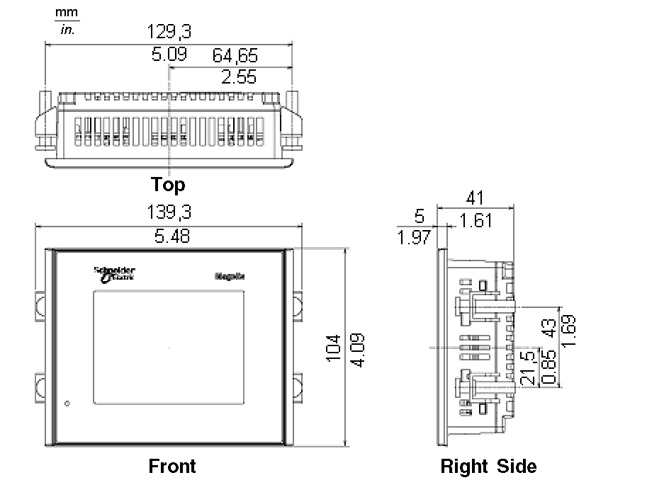

# XBT GT1005 Series Dimensions

XBT GT1005 Series Dimensions

The following illustrations show the dimensions for the XBT GT1105, 1135, and 1335 panels.

Dimensions with Cables

Installation with Spring Clips

NOTE: XBT Z3002 spring clip fasteners must be ordered separately.

Installation with Screw Fasteners

35010372.19

© 2016 Schneider Electric. All rights reserved.