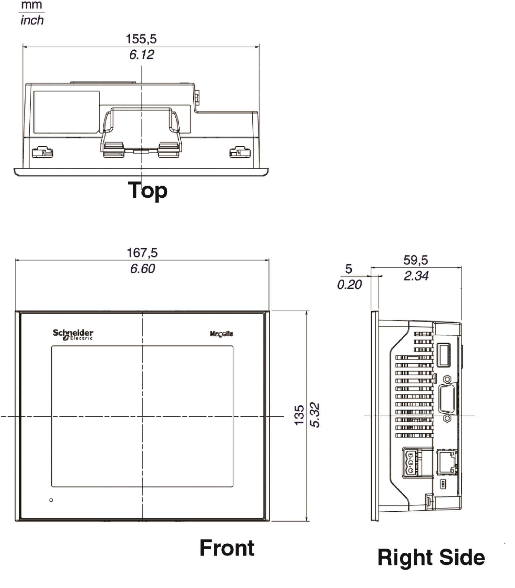
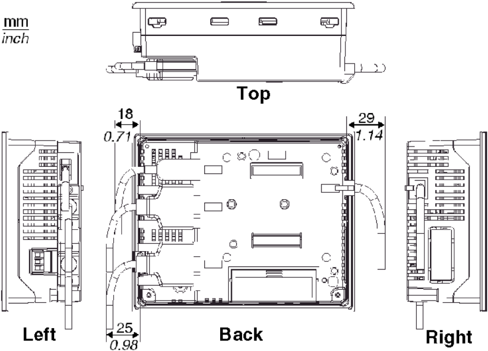
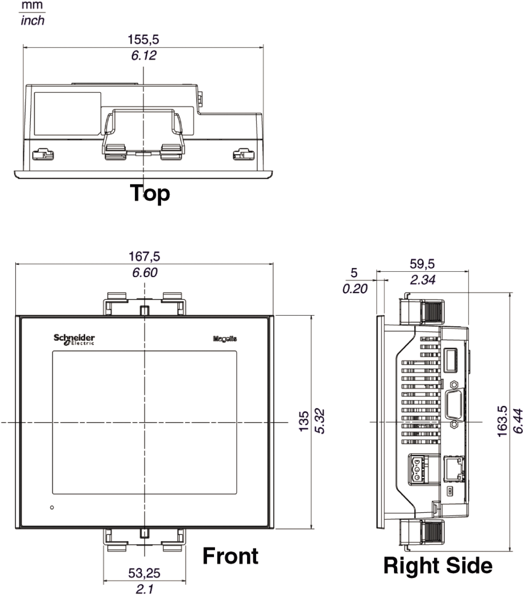
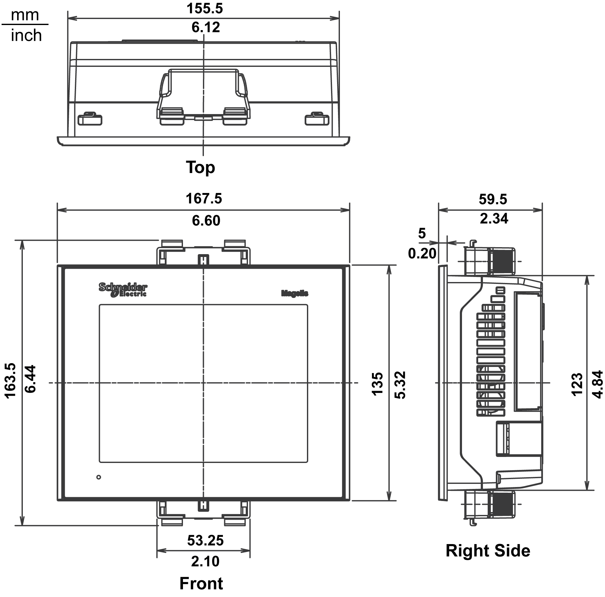
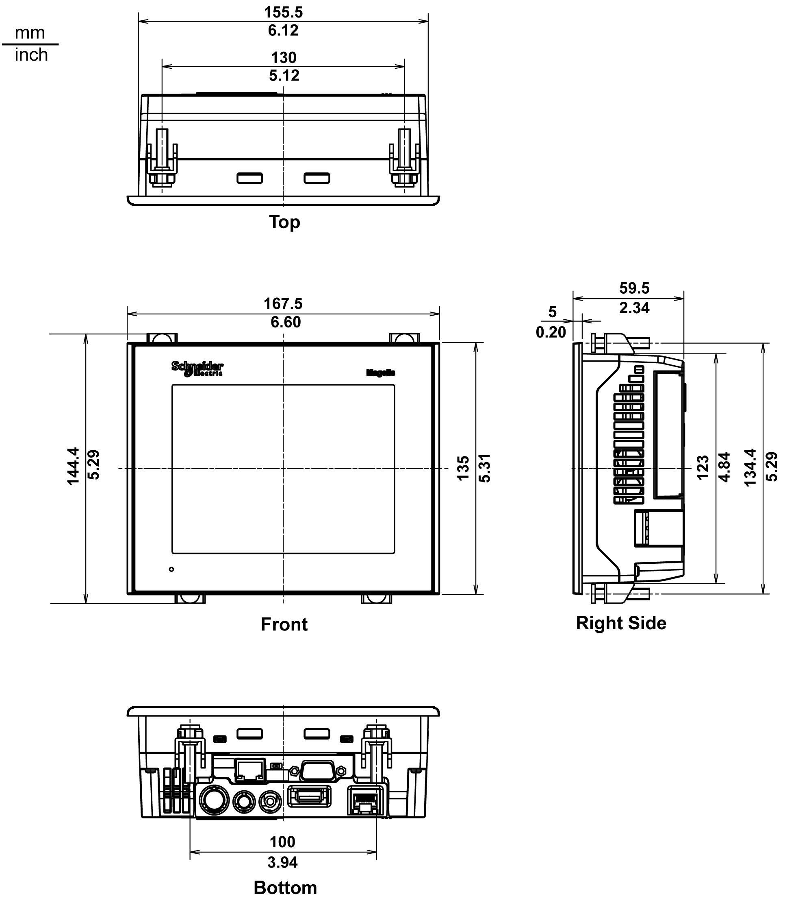

# XBT GT2000 Series Dimensions

XBT GT2000 Series Dimensions

The following four illustrations show the dimensions for the XBT GT2110, 2120, 2130, 2220, 2330, and 2930 panels.

Dimensions with Cables

Installation with Spring Clips

NOTE: Spring clip fasteners must be ordered separately (ref. XBT Z3002)

Installation with Screw Fasteners

Dimensions of XBT GT2430

Dimensions of XBT GT2430 with Cables

Installation of XBT GT2430 with Spring Clips

NOTE: Spring clip fasteners must be ordered separately (ref. XBT Z3002)

NOTE: Mounting XBT GT2430 with spring clips does not allow access to the COM1 and COM2 ports. If these ports are required, please use screw fasteners.

Installation of XBT GT2430 with Screw Fasteners

35010372.19

© 2016 Schneider Electric. All rights reserved.