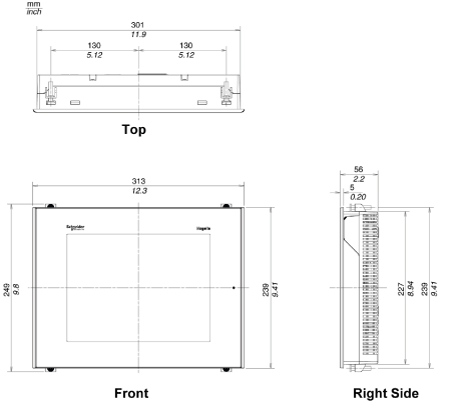
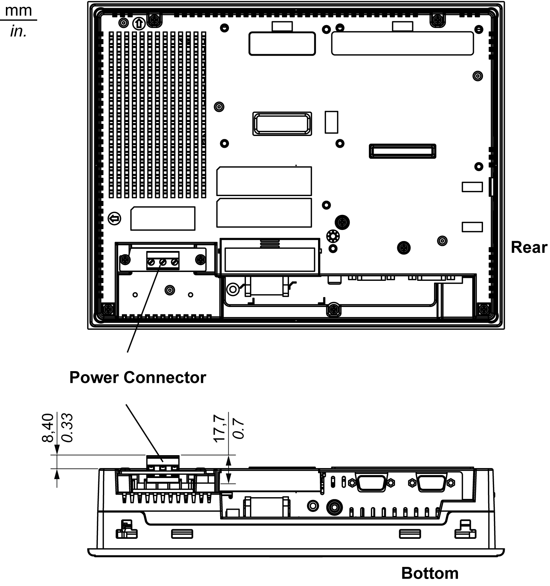
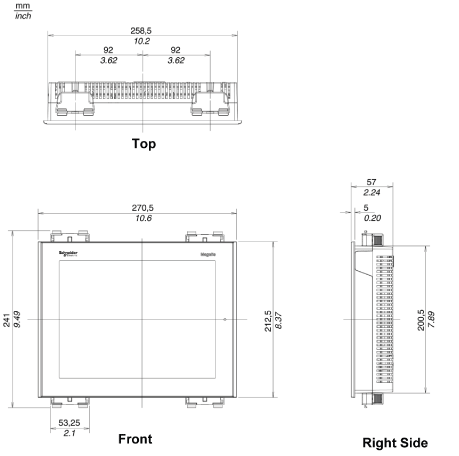

# XBT GT5000 Series Dimensions

XBT GT5000 Series Dimensions

Dimensions of XBT GT5230

Dimensions of XBT GT5230 with Cables

Installation of XBT GT5230 with Spring Clips

NOTE: XBT Z3002 spring clip fasteners must be ordered separately.

Installation of XBT GT5230 with Screw Fasteners

Dimensions of XBT GT5330/5340/5430

Dimensions of XBT GT5330/5340/5430 with Cables

Installation of XBT GT5330/5340/5430 with Spring Clips

NOTE: XBT Z3002 spring clip fasteners must be ordered separately.

Installation of XBT GT5330/5340/5430 with Screw Fasteners

35010372.19

© 2016 Schneider Electric. All rights reserved.