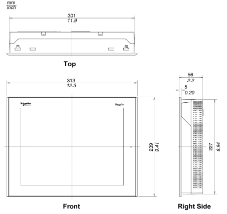
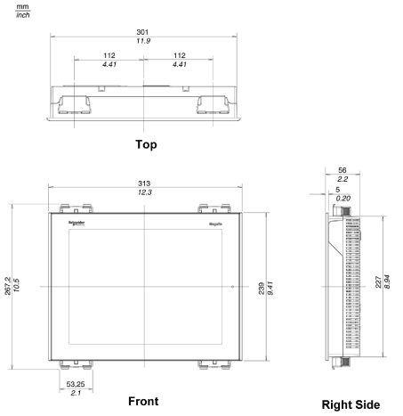
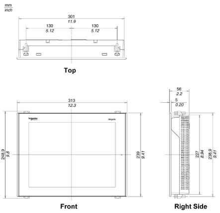

# XBT GT6000 Series Dimensions

XBT GT6000 Series Dimensions

Dimensions with Cables

Installation with Spring Clips

NOTE: XBT Z3002 spring clip fasteners must be ordered separately.

Installation with Screw Fasteners

35010372.19

© 2016 Schneider Electric. All rights reserved.