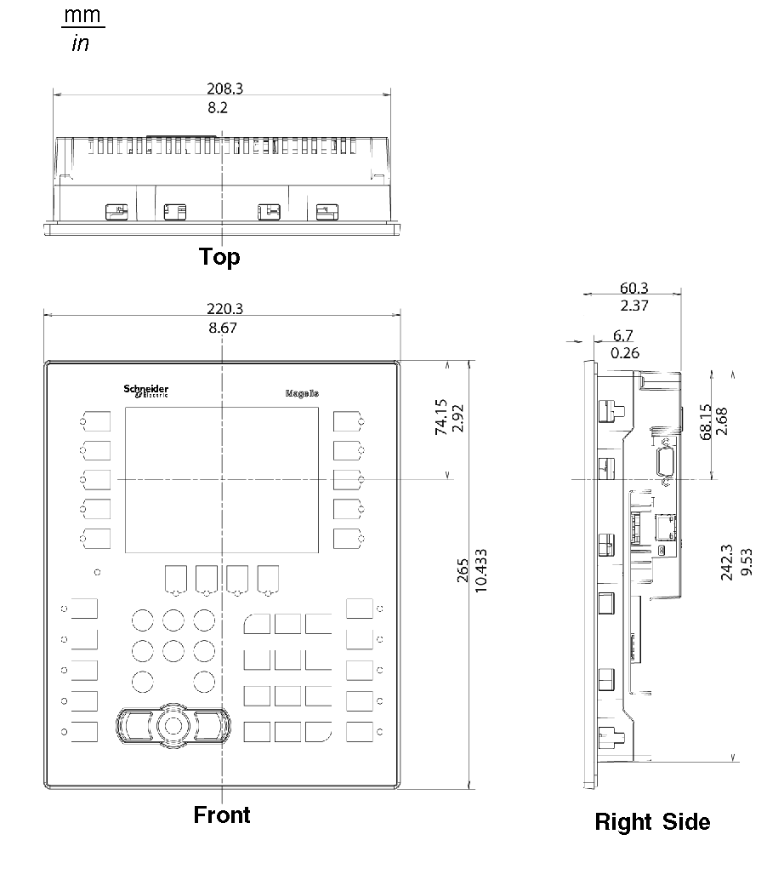
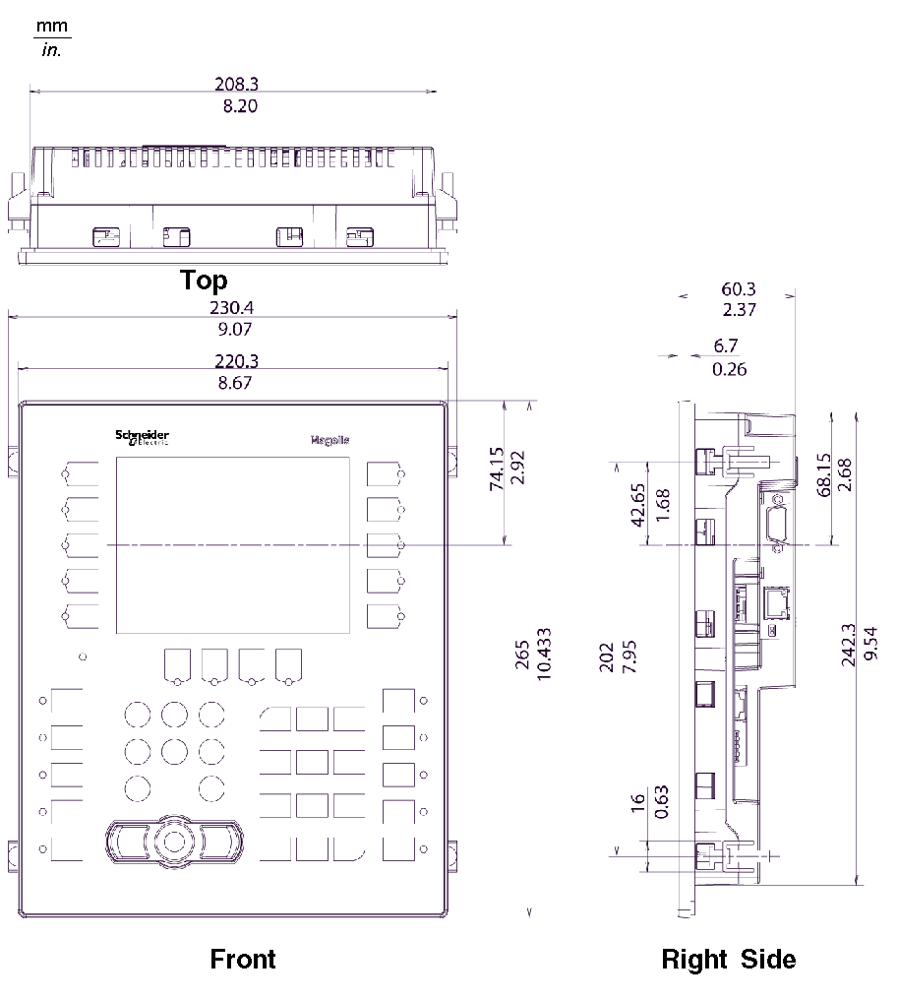

# XBT GK2000 Series Dimensions

XBT GK2000 Series Dimensions

The following illustrations show dimensions for the XBT GK2120 and 2330 keypad panels.

Dimensions with Cables

NOTE: The XBT GK2120 does not support Ethernet.

Installation with Spring Clips

Installation with Screw Fasteners

NOTE: XBT ZGFIX screw installation fasteners must be ordered separately.

35010372.19

© 2016 Schneider Electric. All rights reserved.