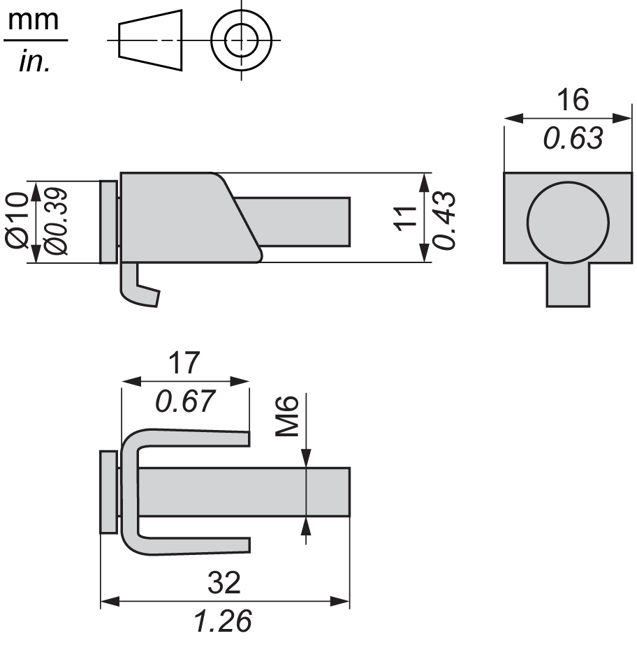

# Installation Fasteners

Installation Fasteners

Introduction

Two types of fasteners can be used to mount the XBT GT and XBT GK ranges:

oscrew installation fasteners,

ospring clips.

| Unit | Spring Clips | Screw Installation Fasteners |
| --- | --- | --- |
| XBT GT1005 series | 2 | 4 |
| XBT GT2000 series | 2\* | 4 |
| XBT GT4000 series | 4 | 4 |
| XBT GT5000 series | 4 | 4 |
| XBT GT6000 series | 4 | 4 |
| XBT GT7000 series | 4 | 8 |
| XBT GK2000 series | 10 | 4 |
| XBT GK5000 series | 12 | 8 |
| XBT GK series delivered with spring clips. XBT GT series delivered with screw installation fasteners. | | |

\* Mounting XBT GT2430 with spring clips does not allow access to the COM1 and COM2 ports. If these ports are required, please use screw fasteners.

Spring Clip Dimensions

Screw Installation Fasteners Dimensions

35010372.19

© 2016 Schneider Electric. All rights reserved.