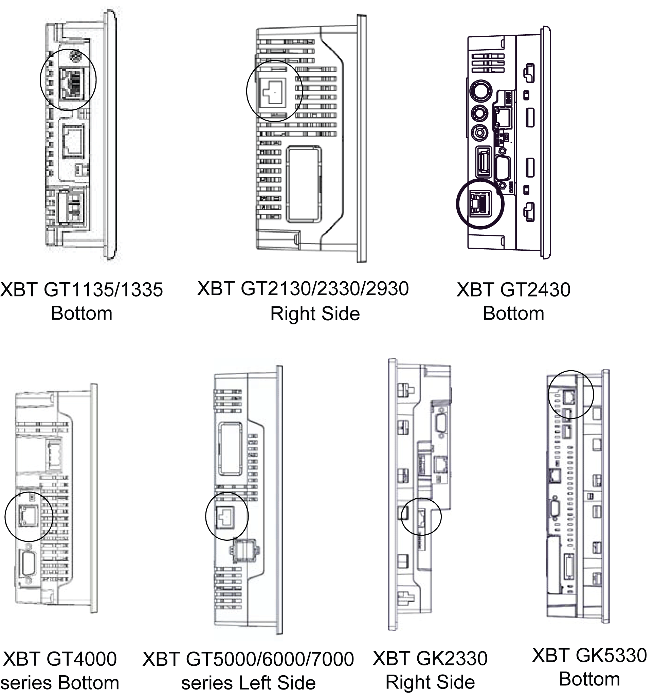

# Ethernet Cable Connector

Ethernet Cable Connector

Presentation

Introduction

The XBT GT series (except for the XBT GT1105/2110/2120/2220 models) and the XBT GK series (except for the XBT GK2120) comes equipped with an IEEE 802.3 compliant Ethernet interface, that transmits and receives data at 10 Mbps or 100 Mbps.

Ethernet Cable Connector

The following illustration displays the location of the RJ45 Ethernet cable connector:

|  |
| --- |
| Caution_Color.gifCAUTION |
| IMPROPER CONNECTIONS CAN DAMAGE COMMUNICATION PORTS |
| oDo not confuse the R-J45 Ethernet connector with the RJ-45 COM1/COM2 serial port.  oDo not connect the serial cable to the Ethernet port.  oDo not connect the Ethernet cable to the serial port.  oCarefully observe the product markings distinguishing between the Ethernet and serial ports. |
| Failure to follow these instructions can result in injury or equipment damage. |

NOTE: Ethernet networks should be installed by a trained and qualified person.

1:1 connections should be made with a hub or a switch. It is possible to use the 1:1 connection with a cross cable depending on the connected PCs and network cards.

35010372.19

© 2016 Schneider Electric. All rights reserved.