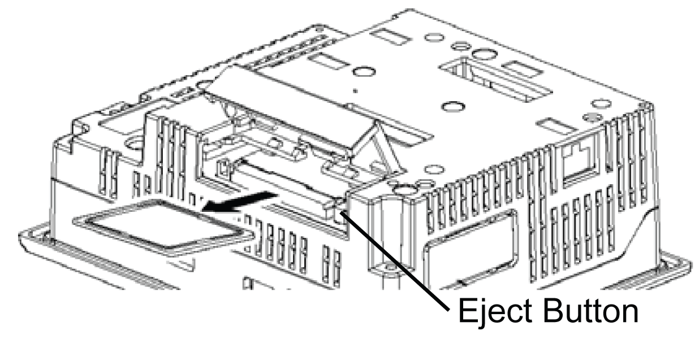

# CF Card

CF Card

CF Card Installation and Removal

Introduction

CF Cards can be used store the following types of data:

oHistorical Data

oRecipe Data

oAlarm Data

oProject Backups

Please refer to the Vijeo Designer Online Help for more information on using the CF Card in your project. The following target machines support the use of CF cards:

oXBT GT2000 series (except for XBT GT2110)

oXBT GT4000 series

oXBT GT5000 series

oXBT GT6000 series

oXBT GT7000 series

oXBT GK series

oXBT GH series

Precautions

When using the unit and a CF card, follow the precautions below:

oPrior to inserting or removing a CF card, be sure that the ACCESS lamp is not flashing. Only remove the CF card when the light is either OFF or Solid Green. If you do not, CF card internal data may be damaged or lost. See Location of CF Card DIP Switches for details.

oCheck that the CF card DIP switch settings are [appropriate](../Lynx_Specifications_Intro/Lynx_Specifications_Intro-18.htm#XREF_D_SA_0021259_8).

oWhile a CF card is being accessed, never turn OFF or reset the unit, or insert or remove the CF card. Prior to performing these operations, use Vijeo Designer to create and use a special unit application screen that will prevent access to the CF card. See Vijeo Designer online help for further details.

oPrior to inserting a CF card, familiarize yourself with the CF card’s front and rear face orientation, as well as the CF card connector’s position. If the CF card is not correctly positioned when it is inserted into the unit, the CF card’s internal data and the unit may be damaged or broken.

oBe sure to use only CF cards manufactured by Schneider Electric.

oOnce unit data is lost, it cannot be recovered. Since accidental data loss can occur at any time, be sure to back up all unit screen and CF card data regularly. See the Vijeo Designer Online Help for more information on backing up your unit’s data.

|  |
| --- |
| Caution_Color.gifCAUTION |
| CF CARD DATA LOSS |
| oDo not bend the CF card.  oDo not drop or strike the CF card against another object.  oKeep the CF card dry.  oDo not touch the CF card connectors.  oDo not disassemble or modify the CF card. |
| Failure to follow these instructions can result in injury or equipment damage. |

Inserting the CF Card

| Step | Action |
| --- | --- |
| 1 | Slide the CF card cover in the direction shown here, then upwards to open the cover.  G-SA-0035808.3.gif-high.gif |
| 2 | Insert the CF card in the CF card Slot, until the ejector button is pushed forward.  G-SA-0035809.3.gif-high.gif |
| 3 | Close the cover. (As shown).  G-SA-0035810.3.gif-high.gif |
| 4 | Confirm that the CF Card Access LED turns ON.  You cannot access the CF Card with the CF Card cover opened. However, if the CF Card is being accessed, the access will continue even if you open it on the way. |

Removing the CF Card

Simply reverse the steps shown in the previous procedure.

Prior to removing the CF card, confirm that the CF Card Access LED is turned OFF.

The following figure displays how to remove the CF card:

CF Card Handling

The CF card has a life expectancy of 100,000 write cycles. Therefore, be sure to back up all CF card data regularly to another storage media. (100,000 times assumes the overwriting of 500 kilobytes of data in DOS format). See Vijeo Designer online help for information on managing CF Card data.

The following table presents two methods to back up data.

| If | Then | And |
| --- | --- | --- |
| Your PC is equipped with a PC card slot | To view CF card data on a personal computer, first, insert the CF card into a CF card adaptor XBT ZGADT. | Save data CF card on the PC. |
| Your PC is not equipped with a PC card slot | Use a standard XBT ZGADT type PC Card or CF card reader. | Save data CF card on the PC. |

NOTE: Depending on the setup of your PC, it is possible that the card reader may not operate correctly.

The connection between a personal computer and CF card reader has been tested using a Windows® compatible machine. Check that CF card reader is correctly installed and configured. Please contact your PC or CF card reader manufacturer directly for details.

35010372.19

© 2016 Schneider Electric. All rights reserved.