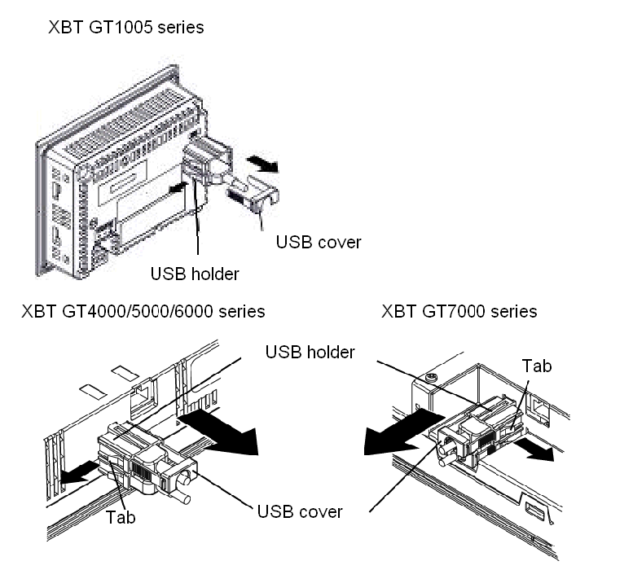

# USB Holder

USB Holder

Introduction

When using a USB device, you can attach a USB holder to the USB interface on the side of the unit to prevent the USB cable from being disconnected. The USB holder can be used with the following units:

oXBT GT1005 series

oXBT GT4000 series

oXBT GT5000 series

oXBT GT6000 series

oXBT GT7000 series

|  |
| --- |
| Caution_Color.gifCAUTION |
| LIVE VOLTAGE |
| To prevent an electric shock, unplug the unit’s power cord from the 24 Vdc power supply prior to attaching or detaching any connector(s) to or from the unit. |
| Failure to follow these instructions can result in injury or equipment damage. |

Attaching the USB Holder

| Step | Action |
| --- | --- |
| 1 | Attach the USB holder to the USB Host Interface on the main unit. Hook the upper pick of the USB holder to the attachment hole of the main unit, and insert the lower pick as shown below to fix the USB holder.  G-SA-0036608.1.gif-high.gif |
| 2 | Insert the USB cable into the USB host interface.  G-SA-0036609.1.gif-high.gif |
| 3 | Attach the USB cover to fix the USB cable in place. Insert the USB cover into the tab of the USB holder.  G-SA-0036610.1.gif-high.gif      If you are installing a second USB cable, repeat steps 2 and 3. |

Removing the USB Holder

Lift up the tab of the USB holder and then remove the USB cover.

35010372.19

© 2016 Schneider Electric. All rights reserved.