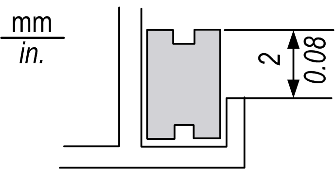

# Regular Cleaning

Regular Cleaning

Cleaning the display

When the surface or the frame of the display gets dirty, soak a soft cloth in water with a neutral detergent, wring the cloth tightly, and wipe the display.

Do not use paint thinner, organic solvents, or a strong acid compound to clean the unit.

Cleaning the Gasket

The gasket protects the unit and improves its water resistance.

|  |
| --- |
| NOTICE |
| GASKET AGING |
| oInspect the gasket periodically as required by your operating environment to keep the initial IP level.  oChange the gasket at least once a year, or as soon as scratches or dirt become visible. |
| Failure to follow these instructions can result in equipment damage. |

During normal maintenance and reinstallation, check the gasket for dirt and scratches.

Inserting the Gasket

The gasket must be inserted correctly into the groove to comply with IP65.

NOTE: The protection level of the product may vary from that which is shown on the ATEX label, as the value on the ATEX label takes into account product aging.

The upper surface of the gasket should protrude approximately 2 mm (0.08 in.) out from the groove. Verify that the gasket is correctly inserted before installing the unit into a panel.

NOTE: Be sure the gasket's seam is inserted into the straight bottom section of the groove. Inserting it into a corner may lead to eventual tearing.

35010372.19

© 2016 Schneider Electric. All rights reserved.