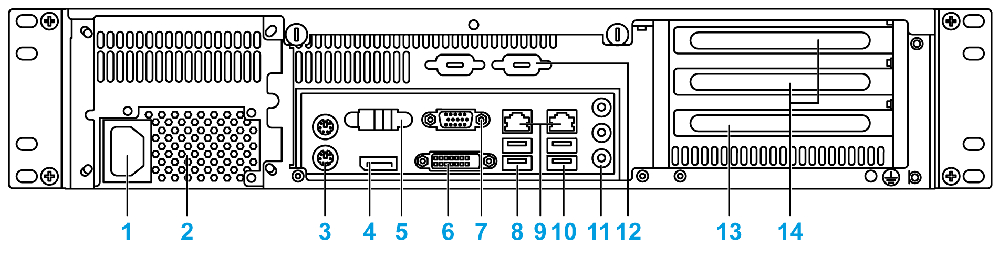

# Rear View

Rear View

1   Power connector

2   Power supply unit

3   KB/MS connector

4   Display port connector

5   Serial port connector

6   DVI connector

7   VGA connector

8   USB port 3.0 x 2

9   LAN port x 2

10   USB port 3.0 x 2

11   Audio port

12   Spare Sub-D9 housing x 2

13   Expansion slot PCI

14   Expansion slot PCIe (x8/x16) x 2