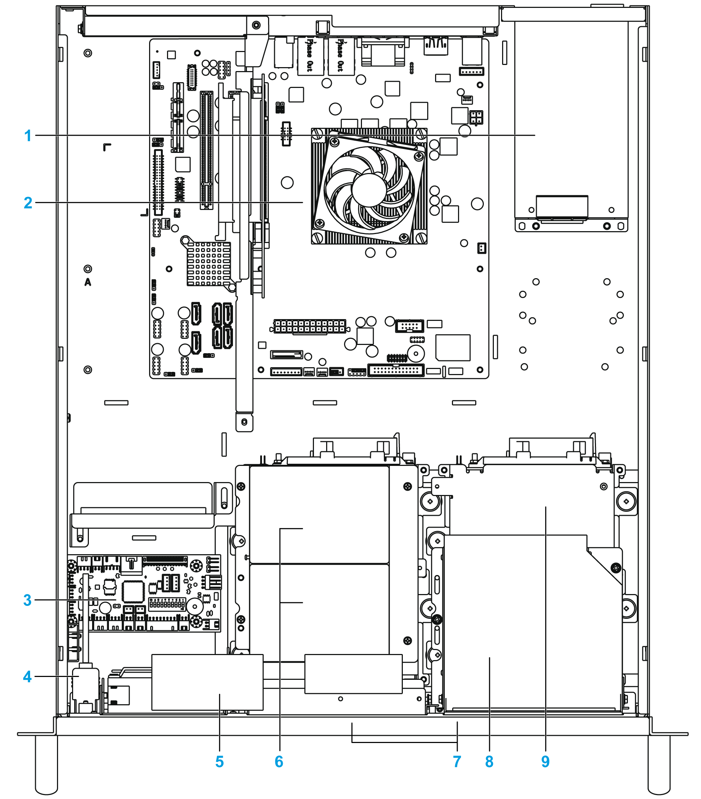

# Top View

Top View

1   Power supply unit

2   Micro ATX motherboard

3   Alarm board with fan speed control

4   Case-open switch

5   Storage fan kit with thumb screw

6   Internal 2.5” drive bays optional x 2

7   Hot swap hard disk tray 3.5" SATA 2 x 4

8   Slim optical drive

9   Internal drive 3.5” SATA 3 for OS