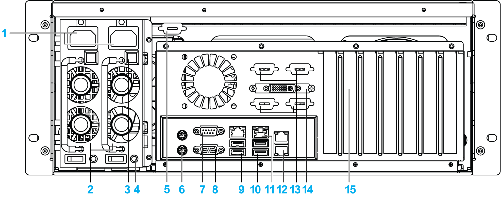

# Rear View with Redundant Power Supply

Rear View with Redundant Power Supply

1   Power supply connector x 2

2   Power supply unit x 2

3   Button

4   LED

5   Spare Sub-D9 housing

6   KB/MS connector

7   Serial port connector

8   VGA connector

9   USB port 2.0 x 2

10   USB port 3.0 x 2

11   LAN port x 2

12   Spare LAN port x 2

13   Spare Sub-D9 housing x 4

14   DVI connector

15   Expansion slots (maximum 7): 2 PCIe x4 and 2 PCIe x8/x16 and 3 PCI. By default-mounted audio ports on 1 slot