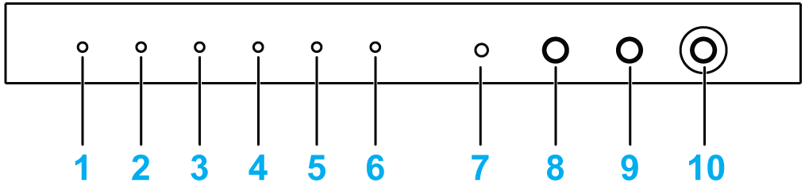
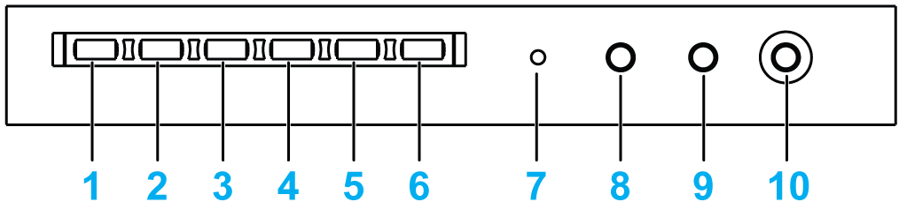

# LED Description

LED Description

The figure shows the LEDs and push-button on the Rack iPC:Universal

1   [Power] LED

2   [Fan] LED

3   [Temperature] LED

4   [RUN] LED

5   [Hard Disk] LED

6   [LAN] LED

7   [Spare] button

8   [ALARM RESET] button

9   [SYSTEM RESET] button

10   [POWER] switch

The figure shows the LEDs and push-button on the Rack iPC:Performance

1   [Power] LED

2   [Fan] LED

3   [Temperature] LED

4   [RUN] LED

5   [Hard Disk] LED

6   [LAN] LED

7   [Spare] button

8   [ALARM RESET] button

9   [SYSTEM RESET] button

10   [POWER] switch