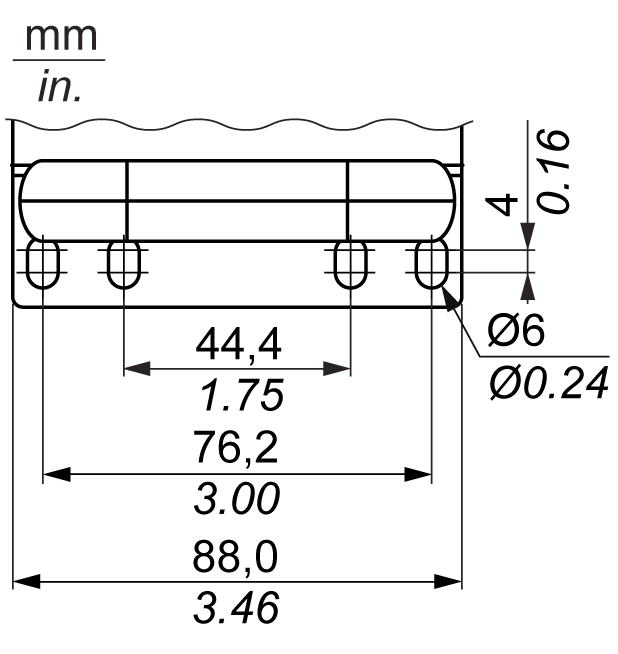

# Installation Location

Installation Location

|  |
| --- |
| Warning_Color.gifWARNING |
| UNINTENDED EQUIPMENT OPERATION |
| oDo not place the Magelis Industrial PC next to other devices that might cause overheating.  oKeep the Magelis Industrial PC away from arc-generating devices such as magnetic switches and non-fused breakers.  oAvoid using the Magelis Industrial PC in environments where corrosive gases are present.  oInstall the Magelis Industrial PC in a location providing a minimum clearance of 50 mm (1.96 in) or more on the left and right sides, and 100 mm (3.93 in) or more above and below the product from all adjacent structures and equipment.  oInstall the Magelis Industrial PC with sufficient clearance for cable routing and cable connectors. |
| Failure to follow these instructions can result in death, serious injury, or equipment damage. |

The Rack iPC unit is designed to use M4 screws. These screws are not for mounting the Rack iPC.They are to prevent the Rack iPC from sliding out of the cabinet:

