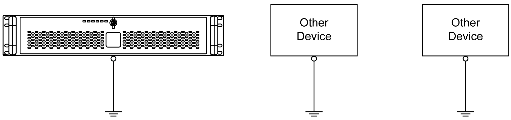

# Dedicated Ground

Dedicated Ground

|  |
| --- |
| Warning_Color.gifWARNING |
| UNINTENDED EQUIPMENT OPERATION |
| oUse only the authorized grounding configurations shown below.  oConfirm that the grounding resistance is 100 Ω or less.  oTest the quality of your ground connection before applying power to the device. Excess noise on the ground line can disrupt operations of the Magelis Industrial PC. |
| Failure to follow these instructions can result in death, serious injury, or equipment damage. |

Connect the Rack iPC ground to a dedicated ground:

