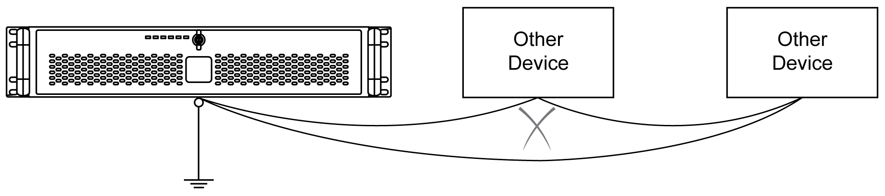

# Shared Ground - Avoid Ground Loop

Shared Ground - Avoid Ground Loop

When connecting an external device to a Rack iPC with the shield ground (SG), ensure that a ground loop is not created. The Rack iPC’s ground connection screw and SG are connected internally.

