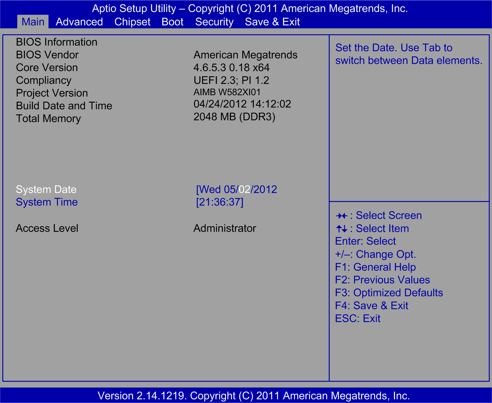

# Main Tab

Main Tab

When you [enter the BIOS](iPC_-_Configuration_of_the_BIOS-2.htm#XREF_D_SE_0033797_18) during startup, the Rack iPC Main BIOS setup menu appears:

This screen, like all the BIOS screens, is divided into three frames:

oLeft

This frame displays the options available on the screen.

oUpper right

This frame gives a description of the user selected option.

oLower right

This frame displays how to move to other screens and the screen edit commands.

This table shows the Main menu options that can be set by you:

| BIOS setting | Description |
| --- | --- |
| Compliancy | Optimized: UEFI 2.3; PI 1.2  Universal: UEFI 2.3; PI 1.2  Performance: UEFI 2.3 |
| Project Version | Optimized: Schneider W582XK04  Universal: Schneider W582XJ05  Performance: Schneider S782XF05 |
| Total Memory | Optimized: 2048 MB (DDR3)  Universal: 4096 MB (DDR3)  Performance: 4096 MB (DDR3) |
| System Time | This is the current time setting. The time must be entered in HH:MM:SS format. The time is maintained by the battery (CMOS battery) when the unit is turned off. |
| System Date | This is the current date setting. The date must be entered in MM/DD/YY format. The time is maintained by the battery (CMOS battery) when the unit is turned off. |

NOTE: The grayed-out options on all BIOS screens cannot be configured. The blue options can be configured by you.