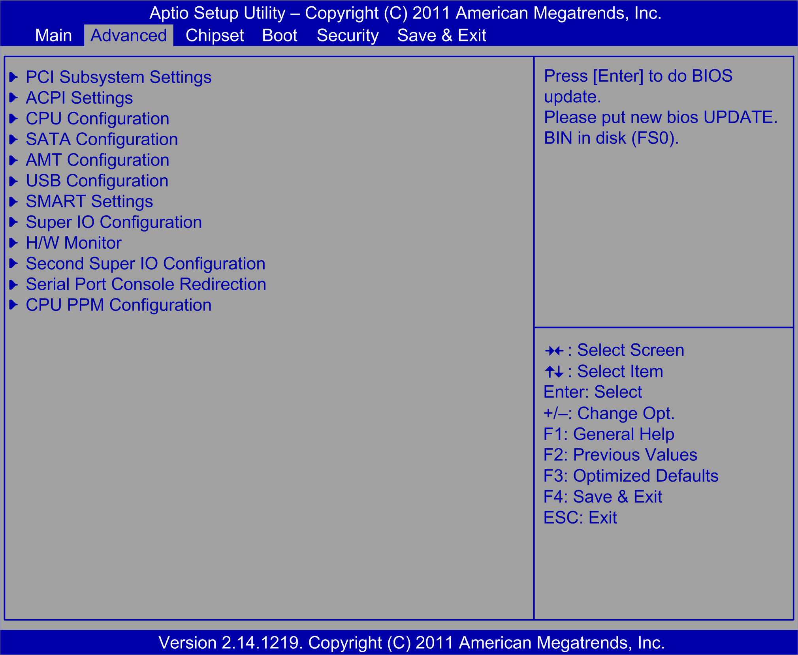
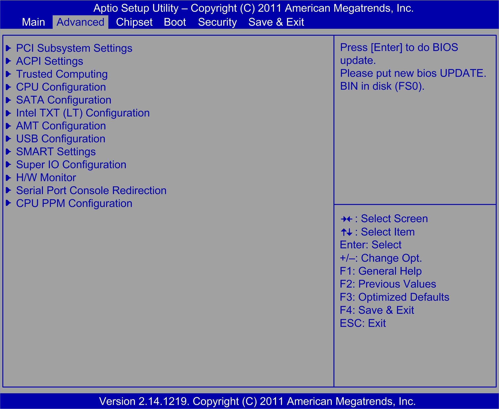

# Advanced BIOS Features Tab

Advanced BIOS Features Tab

The Advanced tab screen for the Rack iPC Optimized:

The Advanced tab screen for the Rack iPC Universal:

The Advanced tab screen for the Rack iPC Performance:

For details about the Advanced submenus, refer to:

o[PCI Subsystem Settings](#XREF_D_SE_0033799_33)

o[ACPI Settings](#XREF_D_SE_0033799_25)

o[Trusted Computing](#XREF_D_SE_0033799_34)

o[S5 RTC Wake Settings](#XREF_D_SE_0033799_24)

o[CPU Configuration](#XREF_D_SE_0033799_26)

o[SATA Configuration](#XREF_D_SE_0033799_27)

o[Intel TXT Configuration](#XREF_D_SE_0033799_35)

o[AMT Configuration](#XREF_D_SE_0033799_15)

o[USB Configuration](#XREF_D_SE_0033799_28)

o[SMART Settings](#XREF_D_SE_0033799_29)

o[Super I/O Configuration](#XREF_D_SE_0033799_30)

o[AOAC Configuration](#XREF_D_SE_0033799_31)

o[H/W Monitor](#XREF_D_SE_0033799_36)

o[Second Super I/O Configuration](#XREF_D_SE_0033799_37)

o[Serial Port Console Redirection](#XREF_D_SE_0033799_38)

o[CPU PPM Configuration](#XREF_D_SE_0033799_39)