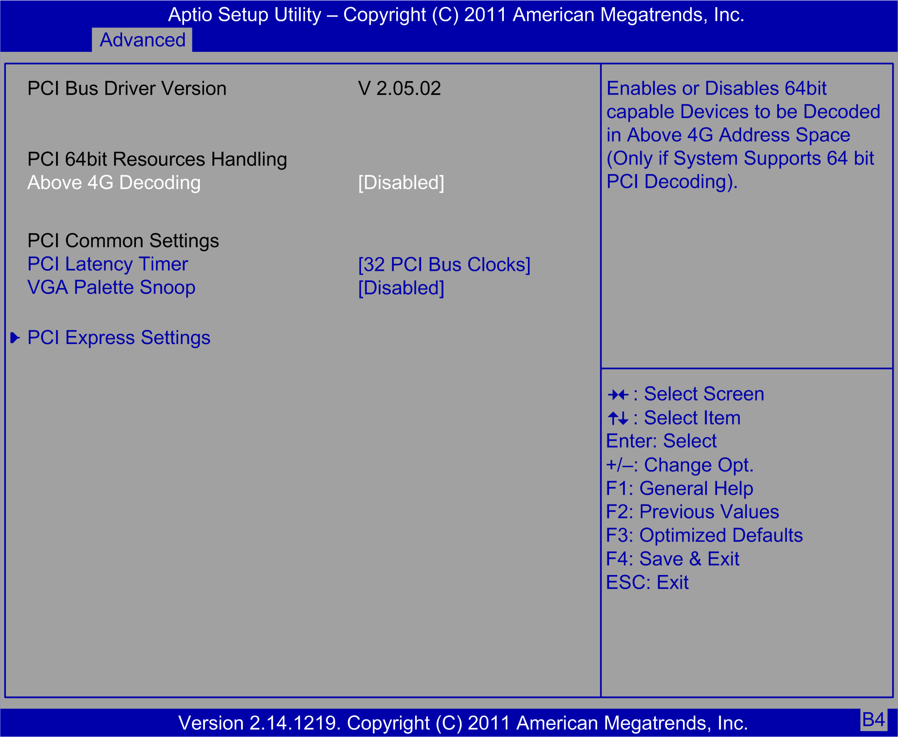

# PCI Subsystem Settings Submenu

PCI Subsystem Settings Submenu

The PCI Subsystem Settings submenu:

This table shows the PCI Subsystem Settings option:

| BIOS setting | Description |
| --- | --- |
| Above 4G Decoding | Enables or disables 64-bit capable devices to be decoded on above 4 G address space if the system supports 64-bit PCI decoding. |