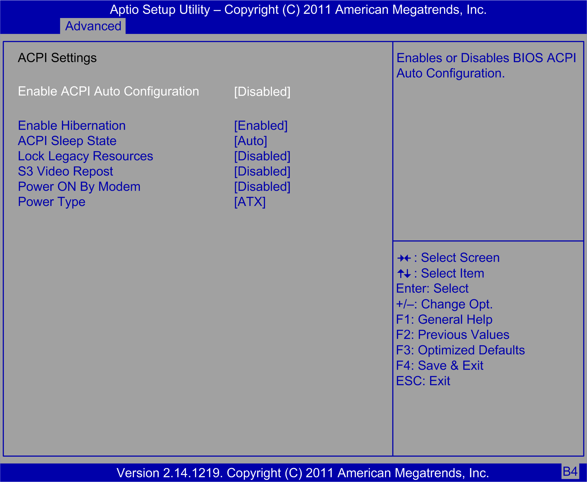

# ACPI Settings Submenu

ACPI Settings Submenu

The ACPI Settings (Advanced configuration and power interface) submenu:

This table shows the ACPI Settings options:

| BIOS setting | Description |
| --- | --- |
| Power On By Modem | Enables or disables the power-on by modem. |
| Enable Hibernation | Enables or disables hibernation. |
| ACPI Sleep State | Optimized: Auto  Universal: Auto  Performance: S3 only (Suspend to RAM) |
| Lock Legacy Resources | Locks legacy resources of the devices. |
| S3 Video Report | Optimized: Enables or disables S3 resume for VBIOS.  Universal: Enables or disables S3 resume for VBIOS. |
| PowerOn by Modem | The system can be awakened from an ACPI sleep by a wake-up signal from a modem that supports this signal. |
| Power Type | Optimized: ATX  Universal: ATX |