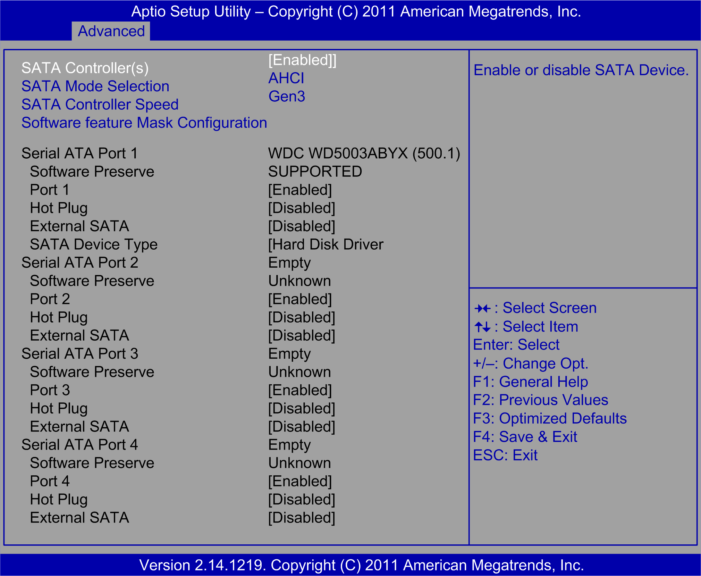

# SATA Configuration Submenu

SATA Configuration Submenu

The SATA Configuration submenu for Optimized Rack iPC:

The SATA Configuration submenu for Universal Rack iPC:

The SATA Configuration submenu for Performance Rack iPC:

This table shows the SATA Configuration options:

| BIOS setting | Description |
| --- | --- |
| SATA Controller(s) | Enables or disables the SATA function.  NOTE: This option is only available if SATA Mode Selection is set to IDE. |
| SATA Mode Selection | Universal: The SATA mode can be either IDE or AHCI. |