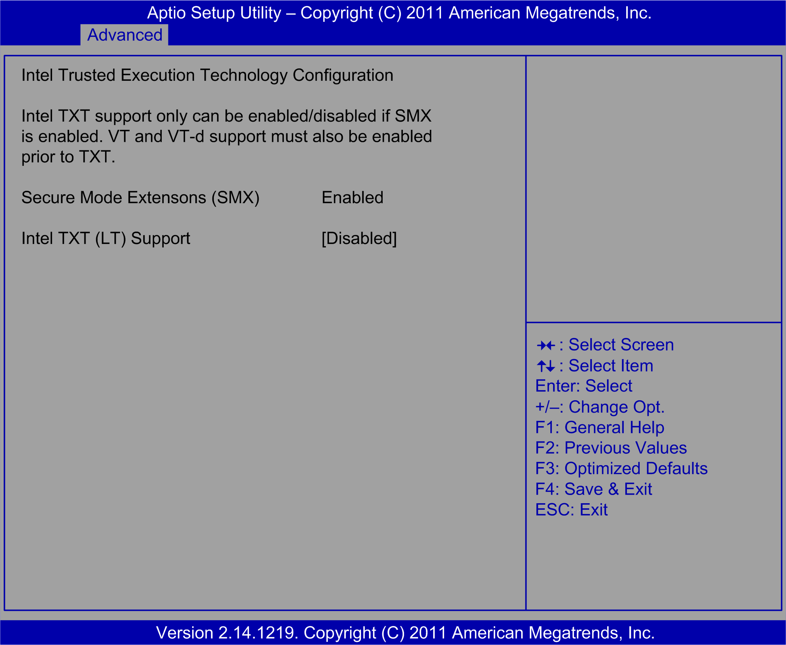

# Intel TXT Configuration Submenu

Intel TXT Configuration Submenu

The Intel TXT Configuration (Intel trusted execution technology configuration) submenu:

This table shows the Intel TXT Configuration options:

| BIOS setting | Description |
| --- | --- |
| Secure Mode Extension (SMX) | Enables or disables the Intel secure mode extensions (SMX) technology. |
| Intel TXT Configuration | Enables or disables the Intel trusted execution technology.  NOTE:  This option is only available if the following Intel technologies are enabled:  oSecure mode extensions (SMX)  oVirtualization technology (VT)  oVirtualization for directed I/O (VT-d) |