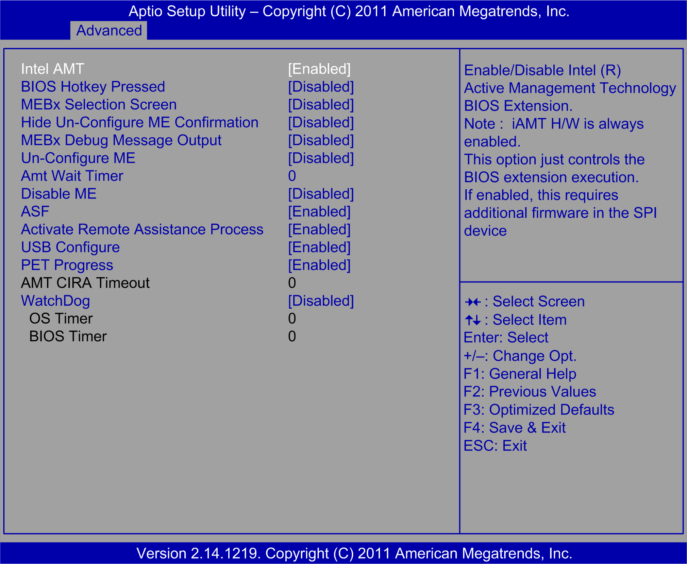

# AMT Configuration Submenu

AMT Configuration Submenu

The AMT Configuration (Intel active management technology configuration) submenu:

This table shows the AMT Configuration options:

| BIOS setting | Description |
| --- | --- |
| Intel AMT | Enables or disables the Intel AMT BIOS extensions. |
| Un-Configure ME | When disabled, ATM/ME can be unconfigured without a password.  When enabled, this action requires a password. |
| Watchdog | When set to Enabled, the watchdog timer monitors the time taken for each task performed by a software or hardware:  oOS timer [0]  oBIOS timer [0] |