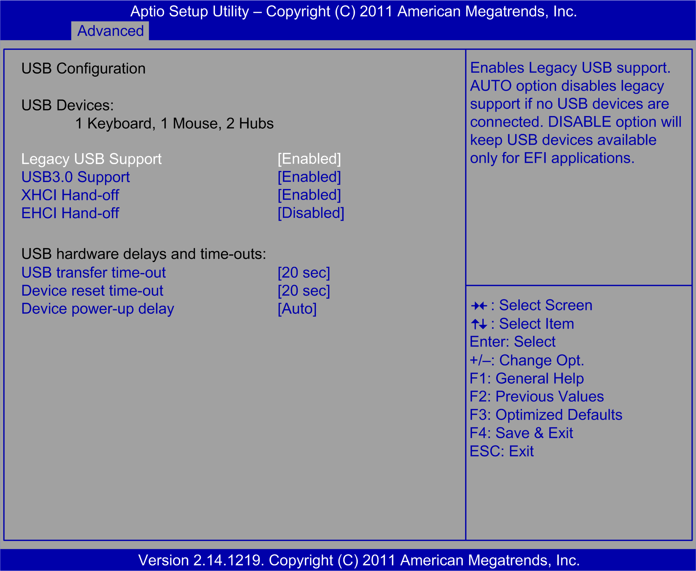

# USB Configuration Submenu

USB Configuration Submenu

The USB Configuration submenu:

This table shows the USB Configuration options:

| BIOS setting | Description |
| --- | --- |
| USB Devices: | 1 keyboard, 1 mouse, 2 hubs. |
| Legacy USB Support | Enables support for legacy USB. The Auto option disables legacy support if no USB devices are connected. |
| USB 3.0 Support | – |
| XHCI Hand-off | – |
| EHCI Hand-Off | This is a work-around for the OS without EHCI hand-off support. |
| Device reset time-out | Sets USB mass storage to reset time-out value of the device. |
| Mass Storage Devices | Displays USB mass storage device information. |