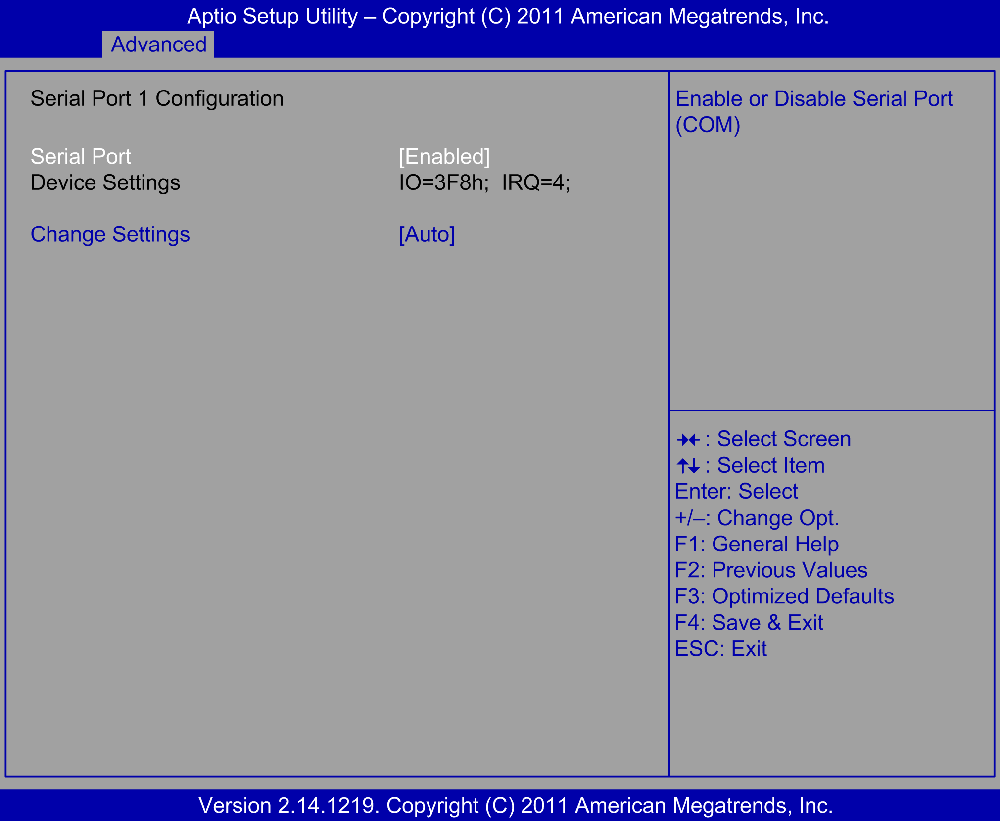

# Super I/O Configuration Submenu

Super I/O Configuration Submenu

The Super I/O Configuration submenu:

Serial Port 1 Configuration submenu:

This table shows the Serial Port 1 Configuration options:

| BIOS setting | Description |
| --- | --- |
| Serial Port | Enables or disables serial port 1. |
| Change Settings | Selection of the optional settings for serial port 1. |

Serial Port 2 Configuration submenu:

This table shows the Serial Port 2 Configuration options:

| BIOS setting | Description |
| --- | --- |
| Serial Port | Enables or disables serial port 2. |
| Change Settings | Selection of the optional settings for serial port 2. |
| Device Mode | Serial port 2 choices:  oStandard serial port mode [Default]  oIrDA 1.0 (HP SIR) mode  oASKIR mode  Performance: STD Printer Mode |

Parallel Port Configuration submenu:

This table shows the Parallel Port Configuration options:

| BIOS setting | Description |
| --- | --- |
| Parallel Port | Enables or disables the parallel port. |
| Change Settings | Selection of the optional settings for the parallel port. |
| Device Mode | Parallel port choices.  Optimized: Auto  Universal and Performance: ECP and EPP 1.9 Mode |