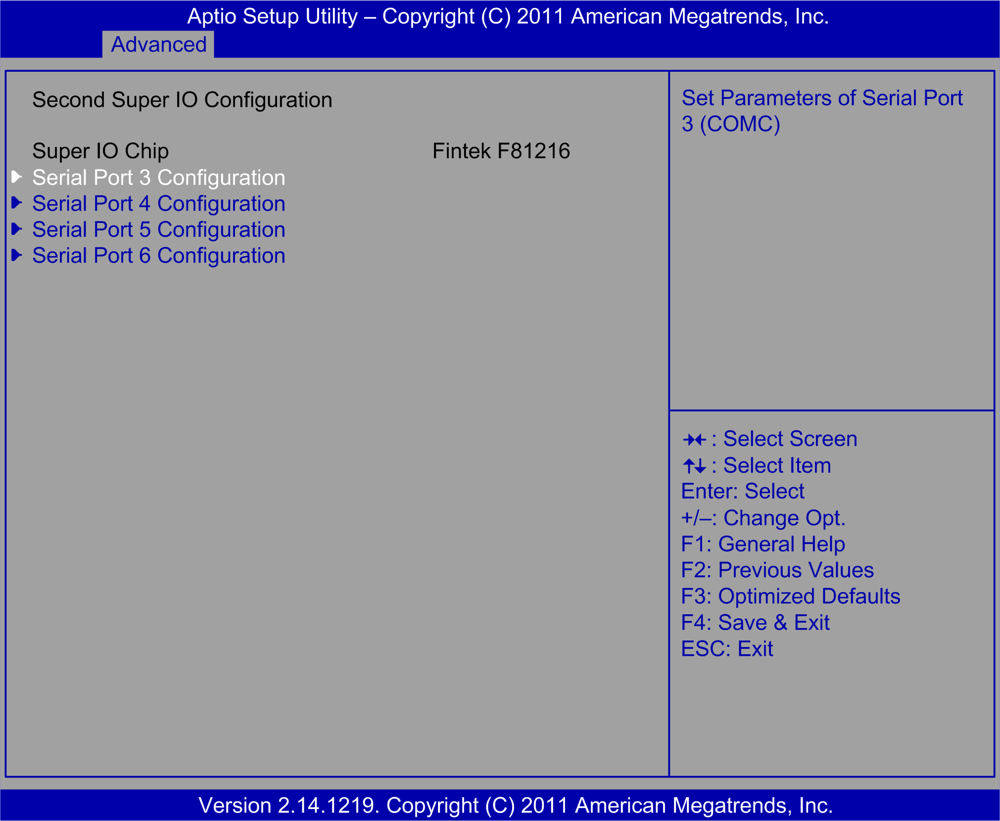

# Second Super I/O Configuration Submenu

Second Super I/O Configuration Submenu

The Second Super I/O Configuration submenu:

Serial Port 3 Configuration submenu:

This table shows the Serial Port 3 Configuration options:

| BIOS setting | Description |
| --- | --- |
| Serial Port | Enables or disables serial port 3. |
| Change Settings | Selection of the optional settings for serial port 3. |
| Auto Flow Control | When COM is to set as RS-485, this port supports auto flow control function. |

Serial Port 4 Configuration submenu:

This table shows the Serial Port 4 Configuration options:

| BIOS setting | Description |
| --- | --- |
| Serial Port | Enables or disables serial port 4. |
| Change Settings | Selection of the optional settings for serial port 4. |

Serial Port 5 Configuration submenu:

This table shows the Serial Port 5 Configuration options:

| BIOS setting | Description |
| --- | --- |
| Serial Port | Enables or disables the serial port 5. |
| Change Settings | Selection of the optional settings for the serial port 5. |

Serial Port 6 Configuration submenu:

This table shows the Serial Port 6 Configuration options:

| BIOS setting | Description |
| --- | --- |
| Serial Port | Enables or disables the serial port 6. |
| Change Settings | Selection of the optional settings for the serial port 6. |