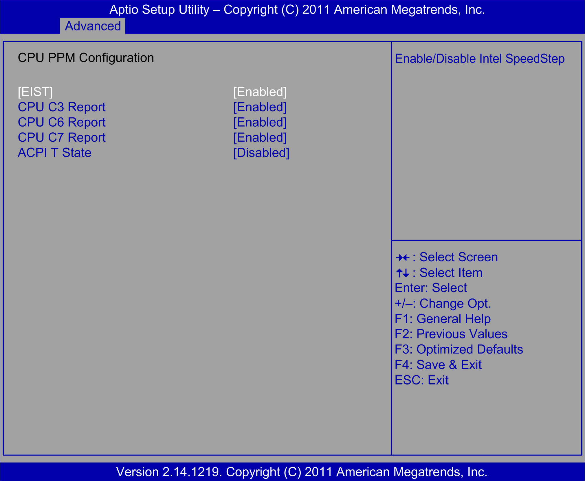

# CPU PPM Configuration Submenu

CPU PPM Configuration Submenu

The CPU PPM Configuration submenu:

This table shows the CPU PPM Configuration options:

| BIOS setting | Description |
| --- | --- |
| EIST | Enables or disables the Intel CPU SpeedStep. |
| Turbo Mode | Performance: [Enabled] |