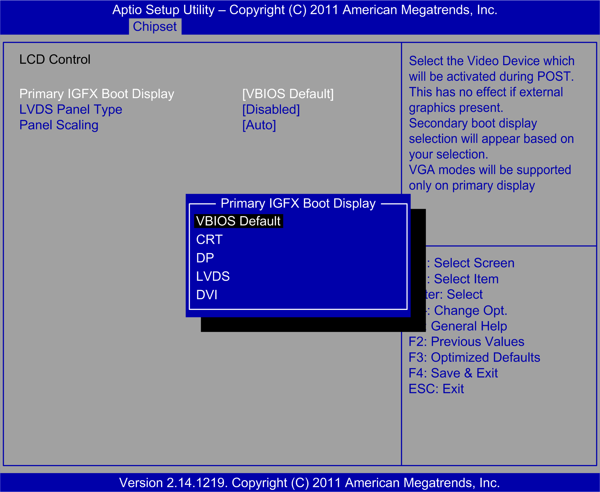

# LCD Control Submenu of the Graphics Configuration Menu

LCD Control Submenu of the Graphics Configuration Menu

The LCD Control submenu

This table shows the LCD Control option:

| BIOS setting | Description |
| --- | --- |
| Primary IGFX Boot Display [VBIOS Default] | Sets the video device that is activated during POST. |