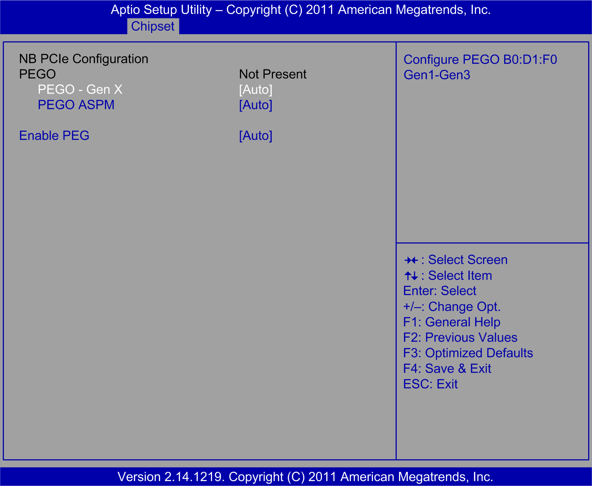

# NB PCIe Configuration Submenu

NB PCIe Configuration Submenu

The NB PCIe Configuration submenu

This table shows the NB PCIe Configuration option:

| BIOS setting | Description |
| --- | --- |
| De-emphasis Control | Performance: -3.5 dB. |