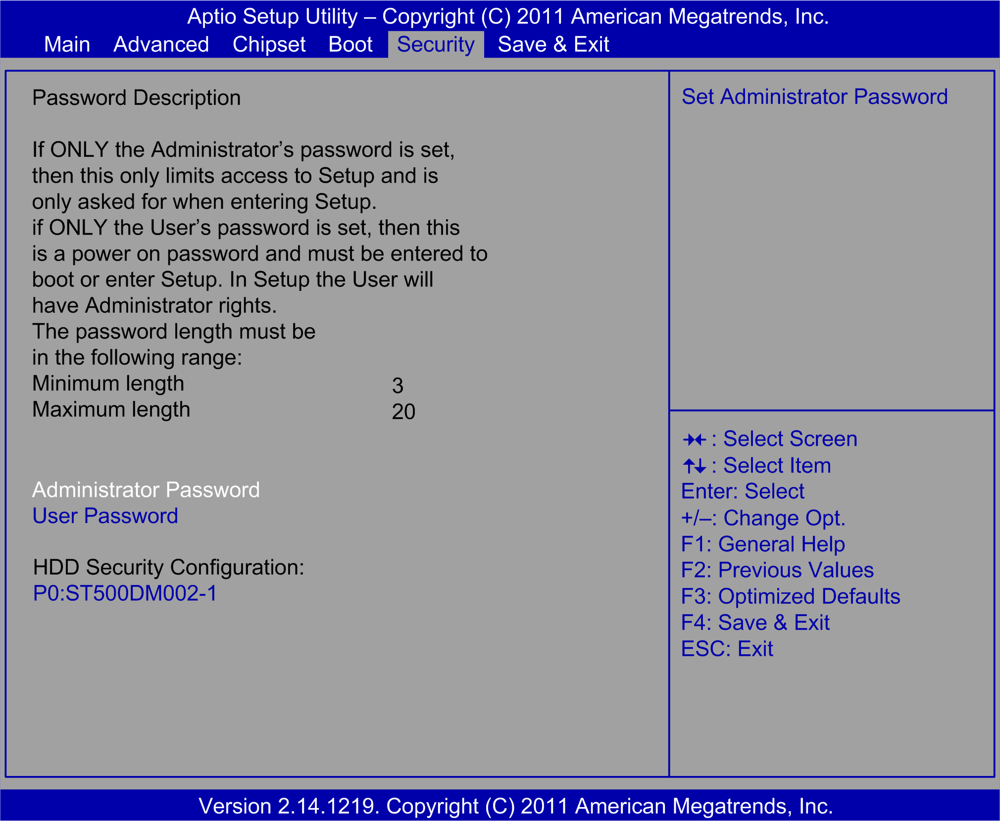

# Security Tab

Security Tab

The Security tab screen:

This table shows the Security menu options:

| BIOS setting | Description |
| --- | --- |
| Change Administrator Password | Enter/change the administrator password.  An administrator password is necessary to edit all BIOS settings. |
| Change User Password | Enter/change a user password.  A user password allows the user to edit only certain BIOS settings. |
| HDD Security Configuration | Optimized:  oP0: ST500DM002-1  Universal:  oP0: WDC WD5003AB  Performance:  oP3: WDC WD1003FB |

NOTE: To access a password, select the password and press ENTER.