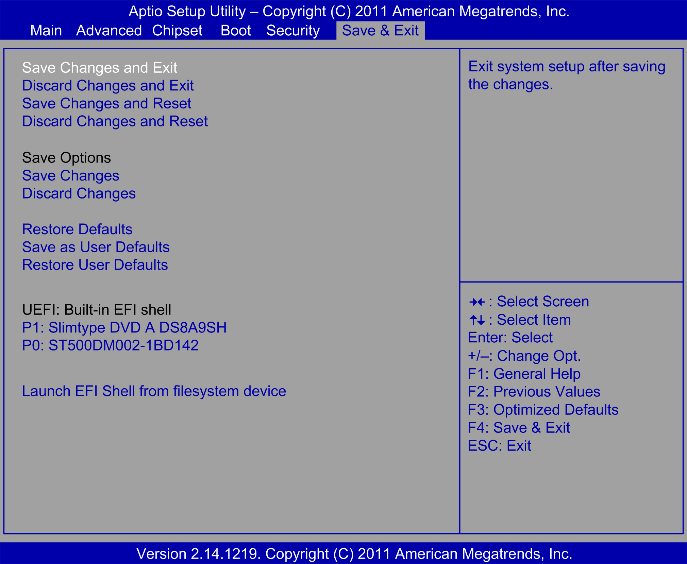

# Save & Exit Tab

Save & Exit Tab

The Save & Exit tab screen:

The table shows the Save & Exit menu options:

| BIOS setting | Description |
| --- | --- |
| Save Changes and Exit | When the system configuration is complete, select this option to save changes, exit BIOS setup, and, if necessary, reboot the computer to take into account all system configuration parameters. |
| Discard Changes and Exit | Select this option to quit setup without making any permanent changes to the system configuration. |
| Save Changes and Reset | Selecting this option displays a confirmation message box. On confirming, you save changes to the BIOS settings, save the settings to CMOS, and restart the system. |
| Discard Changes and Reset | Select this option to quit BIOS setup without making any permanent changes to the system configuration and reboot the computer. |
| Save Changes | Select this option to save the system configuration changes without exiting the BIOS setup menu. |
| Discard Changes | Select this option to discard any current changes and load previous system configuration. |
| Restore Defaults | Select this option automatically to configure all BIOS setup items to the optimal default settings. The optimal defaults are designed for maximum system performance, but may not work for all computer applications.  Do not use the optimal defaults if the computer of the users is experiencing system configuration issues. |
| Save User Defaults | When the system configuration is complete, select this option to save changes as the user defaults without exit BIOS setup menu. |
| Restore User Defaults | Select this option to restore the user defaults. |
| Boot Override | Selects a device to use for a boot override.  Optimized:  oP1: Slimtype DVD A DS8A9SH  oP0: ST500DM002-1BD142  Universal:  oP5: Slimtype DVD A DS8A9SH  oP1: WDC WD5003ABYX-01WERA1  Performance:  oP1: Slimtype DVD A DS8A9SH  oUEFI: Built-in EFI shell  oWDC WD1003FBYX-01Y7B1 |