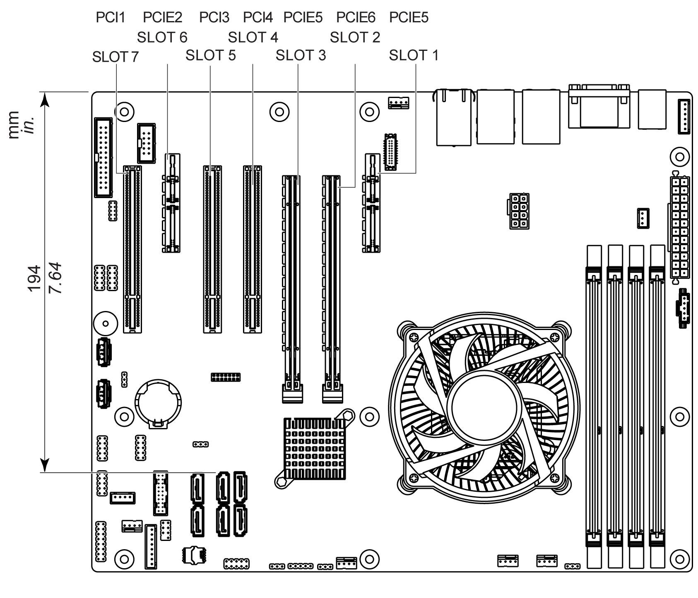

# PCI Card Dimensions

PCI Card Dimensions

NOTE: PCI cards cannot exceed the following dimensions.

PCI full length and standard height for the Rack iPC Universal and Optimized:

oLength: 187 mm (7.36 in.)

oHeight: 106.7 mm (4.2 in.)

PCI card maximum length:

PCI full length and standard height for the Rack iPC Performance:

oLength: 194 mm (7.63 in.)

oHeight: 106.7 mm (4.2 in.)

PCI card maximum length:

