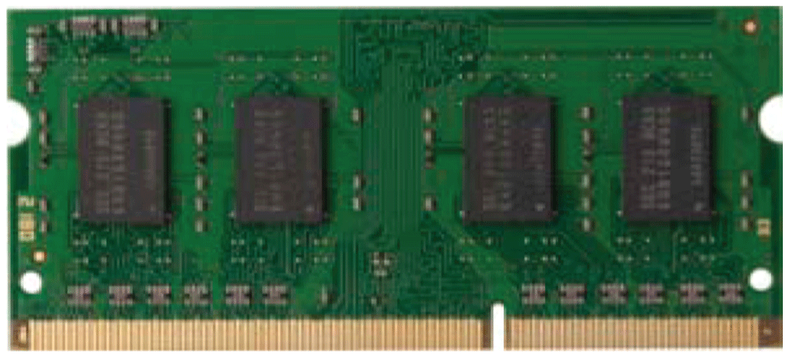

# Overview

Overview

The Rack iPC has four 240-pin memory sockets for DDR3 ECC/Non-ECC 1066/1333/1600 MHz memory cards with maximum capacity of 32 GB (maximum 8 GB for each DIMM).

The Rack iPC supports a CPU with a built-in full speed L3 cache: The built-in third-level cache in the processor yields much higher performance than conventional external cache memories.

The Rack iPC Universal supports a CPU with the following built-in full speed L3 cache:

o3 Mb for Intel Core i3-2120

o3 Mb for Intel Pentium G850

The Rack iPC Optimized supports a CPU with the following built-in full speed L3 cache:

o2 Mb for Intel Celeron G540

The Rack iPC supports only non-ECC DDR3 memory modules and does not support registered dual in-line memory module (RDIMM).

This figure shows a memory card:

