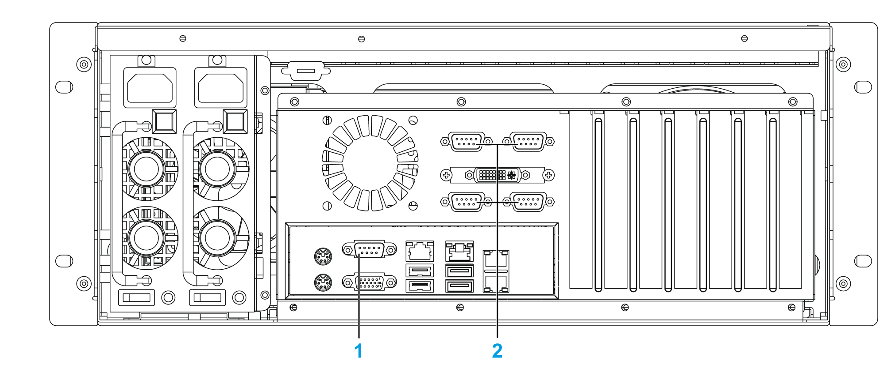
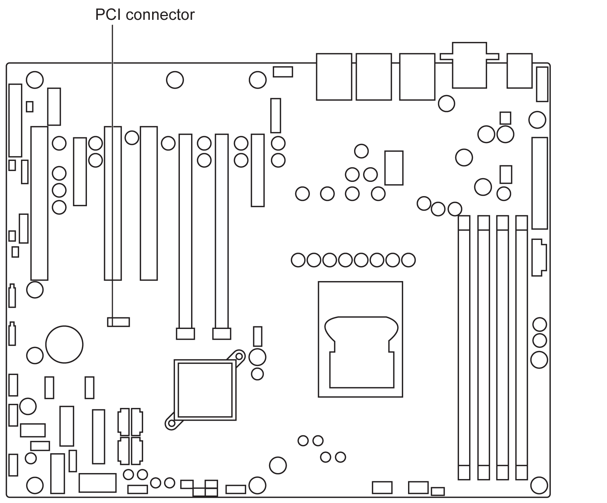

# Serial Line Exchange

Serial Line Exchange

Before installing a serial line interface, shut down Windows® in an orderly fashion and remove all power from the device.

|  |
| --- |
| DangerElectrical_Color.gifDanger_Color.gifDANGER |
| HAZARD OF ELECTRIC SHOCK, EXPLOSION OR ARC FLASH |
| oRemove all power from the device before removing any covers or elements of the system, and prior to installing or removing any accessories, hardware, or cables.  oUnplug the power cable from both the Magelis Industrial PC and the power supply.  oAlways use a properly rated voltage sensing device to confirm power is off.  oReplace and secure all covers or elements of the system before applying power to the unit.  oUse only the specified voltage when operating the Magelis Industrial PC. The AC unit is designed to use 100...240 Vac input. |
| Failure to follow these instructions will result in death or serious injury. |

|  |
| --- |
| Warning_Color.gifWARNING |
| EQUIPMENT DISCONNECTION OR UNINTENDED EQUIPMENT OPERATION |
| oEnsure that power, communication, and accessory connections do not place excessive stress on the ports. Consider the vibration in the environment.  oSecurely attach power, communication, and external accessory cables to the panel or cabinet.  oUse only D-Sub 9-pin connector cables with a locking system in good condition.  oUse only commercially available USB cables. |
| Failure to follow these instructions can result in death, serious injury, or equipment damage. |

|  |
| --- |
| NOTICE |
| ELECTROSTATIC DISCHARGE |
| Take the necessary protective measures against electrostatic discharge before attempting to remove the Magelis Industrial PC cover. |
| Failure to follow these instructions can result in equipment damage. |

NOTE: Be sure to remove all power before attempting this procedure.

| Step | Action |
| --- | --- |
| 1 | Disconnect the power cord from the Rack iPC. |
| 2 | Touch the housing or ground connection (not the power supply) to discharge any electrostatic charge from your body. |
| 3 | Loosen two screws on the rear of the top cover. |
| 4 | Remove the top cover:  G-SE-0033173.1.gif-high.gif |
| 5 | Verify that the kit is complete:  o1 x PCI board  o4 x Sub-D9 connectors each with its ribbon and mounting hardware |
| 6 | Using a screwdriver, remove the metal cut-outs for the Sub-D9 connectors to make holes in the rear of the Rack iPC. |
| 7 | Install the Sub-D9 connectors in the four holes. |
| 8 | Connect the PCI board on the connector of the ATX motherboard. |
| 9 | Check the screw position of ATX motherboard and the PCI board, use threaded spacer and screw to fix:  G-SE-0032975.1.gif-high.gif |
| 10 | Connect a pair of Sub-D9 connector ribbons to the sockets on the PCI board:  G-SE-0032976.1.gif-high.gif |
| 11 | Reinstall the top cover and tighten the screws. |

|  |
| --- |
| Caution_Color.gifCAUTION |
| OVERTORQUE AND LOOSE HARDWARE |
| oDo not exert more than 0.5 Nm (4.5 lb-in) of torque when tightening the installation fastener, enclosure, accessory, or terminal block screws. Tightening the screws with excessive force can damage the installation fastener.  oWhen fastening or removing screws, ensure they do not fall inside the Magelis Industrial PC chassis. |
| Failure to follow these instructions can result in injury or equipment damage. |

The Performance Rack iPC has 1 serial line connector by default.

It has an optional kit (HMIYRINSL41) to install 4 additional serial line connectors.

The Performance Rack iPC serial line connectors:

1   Default serial port on motherboard (COM1)

2   Sub-D9 connectors (COM2, COM3, COM4, COM5) x 4

The ATX motherboard of the Performance Rack iPC showing PCI connector used for the serial line optional kit:

