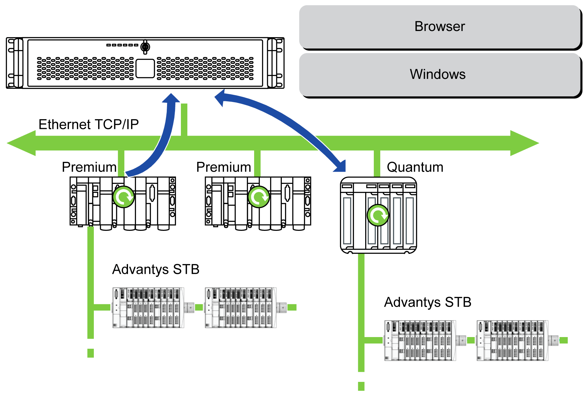

# Transparent Ready Architecture

Transparent Ready Architecture

With its built-in Ethernet 10/100 Mbit/s ports, you can integrate the Rack iPC into full Ethernet architectures, such as Transparent Ready. Transparent Ready devices in this type of architecture enable transparent communication over the Ethernet TCP/IP network. Communication services and Web services permit the sharing and distribution of data between levels 1, 2 and 3 of the Transparent Ready architecture.

Used as a client station, the Rack iPC makes it easier to implement Web client solutions for:

oBasic servers embedded in field devices (Advantys STB/Momentum distributed I/O, ATV 71/38/58 starters, OsiSense identification systems, and so on).

oFactoryCast Web servers embedded in Modicon PLCs (TSX Micro, Premium, and Quantum) or the FactoryCast gateway. The following services are available as standard (without the need for additional programming): alarm management, comprehensive view management, and Web home pages created by users.

oFactoryCast HMI Web servers embedded in Modicon Premium and Quantum PLCs which also provide basic data management services, automatic e-mail sending triggered by specific process events and arithmetic and logic calculations for data preprocessing.