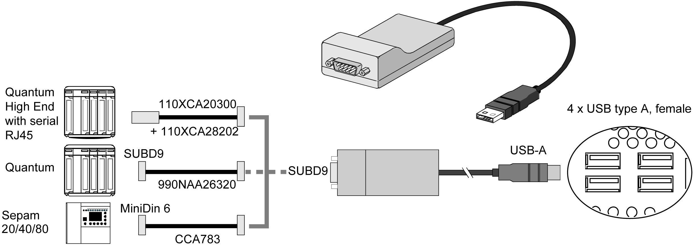

# Cables and Converters

Cables and Converters

For different types of PLCs, the following cables and converters are required:

oTSXPCX1031 connection cable for Nano, Micro and Premium.

This cable is supplied with Unity Pro, PL7-Pro and PL7 Junior software.

oFT20CBCL30 connection cable for the Series 7 family (including TSX 27 PLCs, and TSX/PMX 47/67/87/107 PLCs).

This cable is supplied with the XTEL pack software.

oTSX17ACCPC converter for TSX 17 PLCs.

oTSXCUSB232 converter for connecting the Rack iPC, via an USB port, to remote devices using a RS-232C interface.

NOTE: This device, compatible with Modbus and Uni-Telway, requires the standard Schneider-Electric drivers provided with software such as Unity Pro, PL7-Pro, or a driver on the CD called TLXCDDRV20M.

An example using the TSXUSB232 converter is provided in the drawing below:

