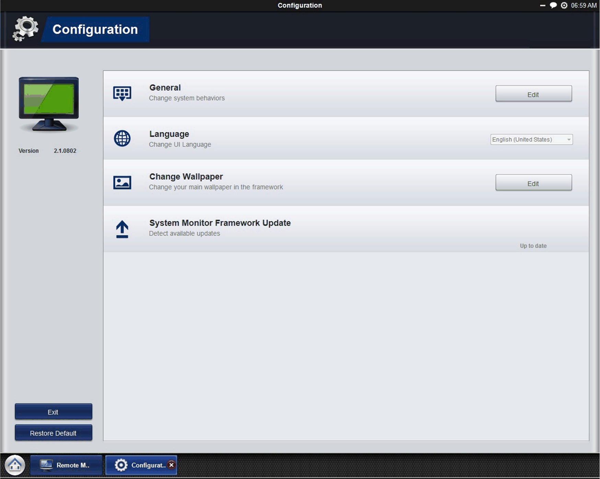

# Configuration

Configuration

In configuration, you can define settings such as automatic startup, language, wallpaper, and updates.

General (Change system behavior): click Edit to set System Monitor to start on system tray and then run on the system tray automatically when the operating system starts up.

Language (Change User Interface Language)

Change Wallpaper (Change your main wallpaper in the framework): click Edit to select your own wallpaper on the main screen.

System Monitor Console Framework Update (Detect available updates): when the console connects to the Internet and finds a new update on the server, the Update icon becomes enabled so you can update online. Sometimes, the update asks you to restart this device when the update is complete.

