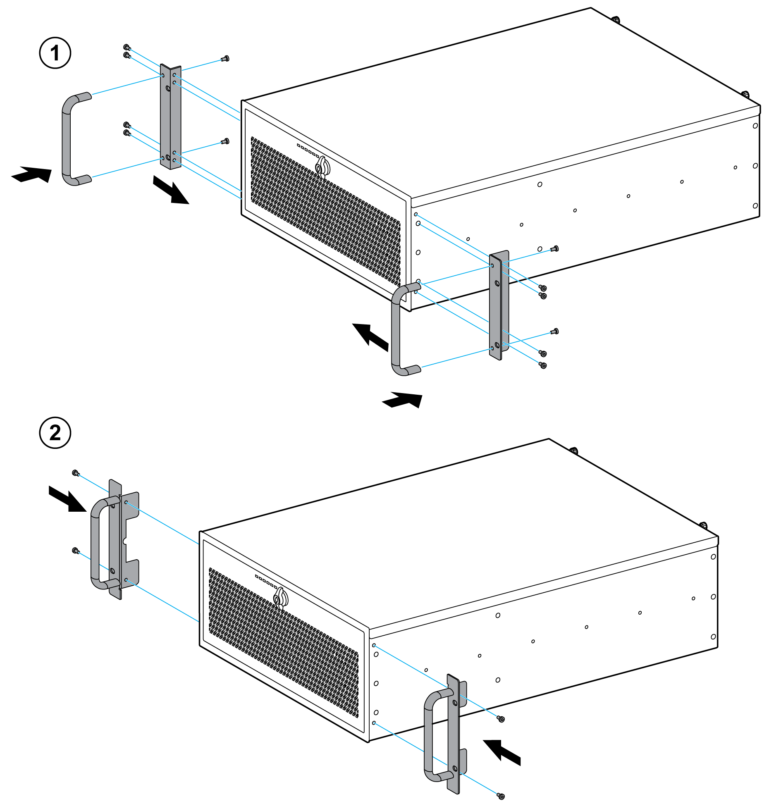

# Attaching the Ears and Handles

Attaching the Ears and Handles

There is a pair of ears and handles in the accessory box. Fasten them to the front-right and front-left mounting ears with the screws provided:

